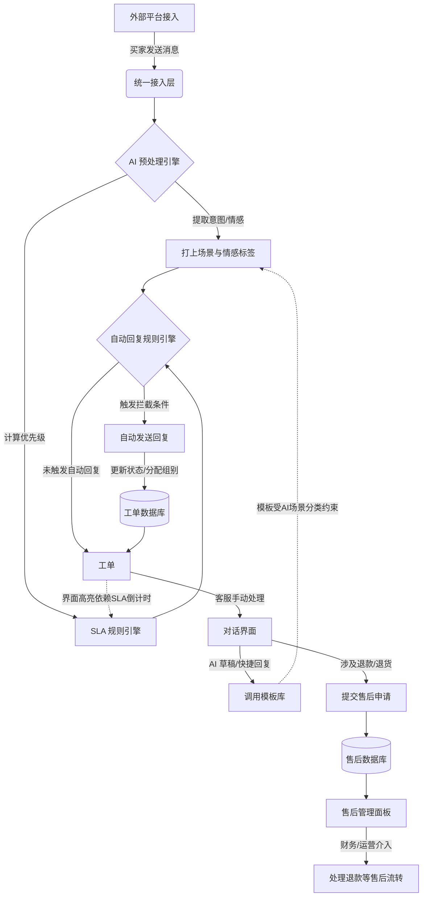

# 哪吒科技生态 - 智能客服子系统 (IntelliDesk) - 产品需求文档 (PRD)

## 1. 产品概述

**产品名称**: IntelliDesk (哪吒科技生态 - 智能客服子系统)
**产品定位**: 面向跨境电商卖家的多平台消息聚合处理中心。
**核心价值**: 通过聚合多平台（如 Amazon、eBay、Shopify 等）客户消息，利用 AI 自动化回复、意图识别与情感分析，帮助卖家一站式管理客户沟通，实时监控 SLA 履约状态，从而提升客服效率与订单利润空间。

## 2. 目标用户

- **客服专员 (Agent)**: 处理日常买家咨询、客诉、售后及物流查询等工单。
- **客服主管 (Team Lead)**: 监控团队响应时效 (SLA)，管理自动回复规则和快捷模板。
- **运营/财务人员**: 处理退款、退货等售后及发票请求。

## 3. 核心业务流程与系统架构图

为确保各模块数据互通、避免业务断层，系统的核心流转逻辑如下：



### 3.1 跨模块联动逻辑与近期开发进度总结

根据近期开发与功能梳理，当前系统的主要逻辑流转、数据联动及最新实现如下：

1. **“工单”与“售后面板”的数据流向**：
   - 提交售后：客服在工单对某笔订单点击“提交售后申请”并填入信息后，生成带 `AS-` 前缀的售后单。此数据会立刻显示在工单右侧售后记录面板中，并同步至**售后管理页面**的全局列表。
   - 操作同步：工单详情页右侧侧栏的售后记录已支持“编辑”与“删除”功能，在此处修改或删除记录将同步影响全局“售后管理”页面，确保数据一致性。

2. **工单与会话的状态流转引擎（核心变更）**：
   - **工单处理状态 (messageProcessingStatus)** 是目前收件箱列表的首要排序权重（排序为：未读 > 未回复 > 已回复）。
   - 完整的自动生命周期：
     - **新入站/新创建**：工单产生时为 `未读 (unread)`（列表显示红点）。
     - **从列表进入工单**：仅当路由切换到该工单时，若状态为 `未读` 或 `NEW`，自动流转为 `未回复 (unreplied)` 与 `TODO`（红点消失）；手动改回「未读」后不会因同页数据刷新被再次改回「未回复」。
     - **客服发送回复**：不论是手动发送、发送 AI 生成内容还是发送模板，发送成功后工单自动变为 `已回复 (replied)`。
     - **买家新消息**：即使处于已回复状态，只要接收到买家新消息，状态立刻重置回 `未读`（红点恢复），确保不漏处理。

3. **发票生成与多语言自动化适配**：
   - 侧栏发票 Tab 具备前置校验，依据母系统是否同步了主体信息 (`storeEntity`) 和 VAT 标识区分状态（生成发票 / 待同步 / 无 VAT）。
   - **多语言机制**：根据工单渠道特征（如 `Amazon DE`, `Amazon FR`），发票预览与 PDF 下载能够自动适配为德语、法语或默认英语；PDF 下载直接由渲染层 DOM 抓取。

4. **AI 与自动化工具整合**：
   - **AI 回复分化**：回复区拆分为基于知识库与会话的“AI 智能生成”与针对已有草稿的“AI 润色”。AI 生成的话术自动标记并采用紫色特殊气泡及“AI助手”身份发出；一旦人工修改，则转为普通客服身份。
   - **全局自动翻译快捷设置**：在回复区提供接收与发送自动翻译的下拉快捷控制面板，支持一键前往系统设置。
   - **工具条**：支持插入模板（选择后直接覆盖输入区）、添加常用通用 Emoji 以及本地文件附件交互演示。

5. **组件显示优化**：
   - 时间维度：列表内使用“工单创建时间（createdAt）”计算相对时间（如“1小时前”）及进行时间的次级排序，使业务时间轴更符合客服对单据生命周期的理解。
   - 交互对齐：“取消”与“发送”等重操作按钮统一向右对齐，各状态展示（国旗图标、SLA倒计时等）得到 UI 精简和一致性处理。

6. **“模板库”场景分类与“自动回复”意图的解耦与绑定**：
   - 模板库中的“场景分类”（如：物流问题、退款请求）目前与 AI 的“意图识别”紧密挂钩。
   - **长期规划**：为了避免系统预设的意图无法满足商家复杂的业务场景，未来需要新增 **「标签与场景分类管理字典」** 功能，允许商家自定义 CRUD（增删改查）新的意图标签，并自主映射到模板和自动回复规则中。

7. **“自动回复动作”与工单状态的映射**：
   - 自动回复规则配置中，若勾选「发送回复后，将消息标记为已回复」，该动作在对接后端后必须真实改变工单中对应 `Ticket` 的 `status` 字段（如变更为 `TicketStatus.RESOLVED` 或 `WAITING_FOR_CUSTOMER`），从而使 SLA 倒计时停止并在 UI 上取消标红。
   - **当前产品范围**：新增/编辑自动回复弹窗**不再提供**「分配给特定客服组」选项（已从界面移除）。若未来要支持自动分配客服组，需单独立项，并与「坐席与分配」能力统一设计。

8. **侧栏内部备注的编辑与删除（最新更新）**：
   - 在工单详情右侧「订单」Tab 的内部备注（橘色气泡）现已支持 **编辑**（铅笔图标）与 **删除**（垃圾桶图标，带确认弹窗）。
   - **编辑态**：采用原位展开的 `textarea`，支持“保存”与“取消”，保存中提供禁用与加载状态。
   - **数据流与权限**：接口层面严格限制仅允许修改和删除 `isInternal === true && senderType === 'agent'` 的消息，后端利用 WebSocket (`message_updated` 和 `message_deleted`) 实现多端实时同步，确保所有在线客服看到的内容一致。

9. **发票附件随会话下发逻辑优化（最新更新）**：
   - 「发票预览与生成」弹窗不仅支持下载 PDF，更支持点击**“发送给客户”**。
   - **发送机制**：点击后将由纯前端生成长图版多页 PDF（`html2canvas` + `jsPDF`），转为 Base64/Blob 附件，与一条预设提示语一同通过真实的 `onSendMessage` 写入当前工单会话流。
   - 这确保了生成的发票能真正以邮件或站内信附件的形式送达客户，而不再是仅停留在模拟提示。

10. **自动翻译配置界面的交互解耦（最新更新）**：
   - 移除原会话输入区上方复杂的浮动悬停面板。目前“自动翻译”相关的系统配置状态，被精简为一个小巧的下拉气泡；且气泡内的开关现已改为**纯视觉只读状态**（不支持直接点击切换）。
   - **目的**：避免局部状态与全局翻译引擎的冲突，强引导用户点击“前往系统设置”进行集中化、全局化配置。回复区右侧同步新增了动态提示标签：“将自动翻译成 德语/英语/法语等”（基于工单母平台推断），提高客服感知。

11. **AI 智能生成与润色的测试种子数据回退机制（最新更新）**：
    - **无真实 API 也能测试**：考虑到演示环境或测试阶段可能未配置有效的 Gemini API Key，已在服务层（`geminiService.ts`）为“AI 智能生成”和“AI 润色”加入了 Fallback（回退）机制。
    - **交互逻辑**：当 AI 接口请求失败或未配置时，点击相关按钮会自动生成包含当前工单上下文（如标题、订单号等）的模拟测试数据，并自动填入回复框。
    - **属性保留与 UI 联动**：该临时生成的测试文本会触发 `isAiGenerated = true` 的状态。发送此内容后，生成的历史消息气泡会保留专属的紫色“AI 星星”标识，并带有“查看引用来源”按钮，点击可弹出知识库引用评价面板，从而使得在没有真实 AI 服务的情况下也能完整测试 AI 相关的全链路 UI 交互。

12. **手动建单与订单同步优化（最新更新）**：
    - **按需拉取代替全量依赖**：为了避免全量同步一个月内数万笔订单带来的性能灾难与时效滞后，常规同步不再强制依赖历史订单全量池。
    - **主动发起工单（正在实现）**：在收件箱列表顶部新增手动建单入口。客服可通过输入母系统平台订单号，系统将按需从母系统回源查询该订单并落库，允许在买家未发送消息前，客服主动新建工单并发起会话。

13. **批量翻译优化与出站消息自动翻译（最新更新）**：
    - **批量翻译引擎**：为减少 AI 调用次数并提升翻译一致性，系统从逐条翻译升级为**批量翻译**。当进入工单或收到多条新消息时，系统会自动合并未翻译的消息并在单次请求中完成处理。
    - **出站消息自动翻译**：对于客服发出的未包含译文且非中文的消息，系统会自动将其翻译为「我的语言」（中文），展示为「原文在上、译文在下」的对照模式。
    - **多路兜底与分片处理**：翻译逻辑支持大批量消息的分片请求（每 50 条一组），并具备错误自动重试与逐条失败标记能力。
    - **前端显示统一**：入站与出站消息统一采用对照布局，自动识别语种并显示国旗标签，大幅提升客服对跨国会话的理解效率。

14. **母系统回复接口接通（最新更新）**：
    - **接口路径**：`/v1/api/ecommerce/platform-conversation/{id}/reply`
    - **实现逻辑**：当客服通过 IntelliDesk 发送给买家的真实消息（非内部备注）时，后端会自动调用母系统的回复接口，实现消息同步回传至电商平台。
    - **参数支持**：支持 `content`（正文）、`attachments`（附件 Base64/URL）、`deliveryTargets`（投递目标）。
    - **Token 机制**：优先使用请求体传入的 `token`，若无则回退至服务端配置的 `NEZHA_API_TOKEN`。

15. **AI 智能回复生成逻辑优化（最新更新）**：
    - **交互逻辑升级**：点击「AI 智能生成」不再直接填充输入框，而是弹出对话框进行预览。
    - **双语预览**：AI 同时生成「我的语言」（中文，供客服确认）与「平台语言」（目标平台语言，供最终发送）。平台语种通过母系统站点 API (`/v1/api/biz/platform-site/all`) 动态识别。
    - **采纳与刷新**：支持一键「采纳」生成的回复并填充至主输入框；支持「刷新」以重新生成不同话术。

16. **平台消息同步与标识优化（最新更新）**：
    - **数据源（仅两接口）**：会话列表用 `GET /v1/api/ecommerce/platform-conversation`；消息列表用 `GET /v1/api/ecommerce/platform-conversation-message`。不使用母系统 `/v1/admin/*`。单条会话详情与对客回复仍为同一路径下的 `GET /v1/api/ecommerce/platform-conversation/{id}`、`POST .../{id}/reply`。`senderType` 依赖消息接口返回字段。
    - **UI 交互增强**：
        - **身份标识**：平台发来的消息（如 Fnac/Rue du Commerce 操作员）统一标记为「平台信息」，并配有 `ShieldCheck` 盾牌图标。
        - **气泡样式**：平台消息采用淡琥珀色背景 (`bg-amber-50/80`) 与标准圆角矩形样式，在视觉上与买家消息（带尖角气泡）和客服回复（蓝色）形成明确区分。
        - **状态透明度**：发送成功后的状态提示由「已送达客户」更正为「已发送至平台」，更准确地反映 API 回调结果。
    - **纠错机制**：针对特定订单（如 `5071418422820M-A`）支持定向重同步与 senderType 自动修正逻辑。

17. **意图与情绪智能识别二次刷新优化（最新更新）**：
    - **交互逻辑**：工单详情页的“意图分类”与“情绪识别”标签均新增刷新按钮（`RefreshCw`）。当开启智能客服模式时，点击刷新按钮即可实时调用 AI（后端 `/api/ai/classify-intent` 及 `/api/ai/classify-sentiment`）对当前会话最新上下文重新研判并写回工单状态。
    - **UI 状态**：识别过程中提供加载动画（旋转图标与禁用状态），确保双项并发操作时互不阻塞。
    - **标签映射归一化**：情绪识别结果（`angry, anxious, neutral, joyful` 等）在后端经归一化逻辑处理后，确保始终以枚举安全的方式落库和渲染。

18. **17track 物流轨迹深度集成（最新更新）**：
    - **API 对接**：全面接入 17track API v2.4（`gettrackinfo` 接口），支持单号自动注册与全量轨迹获取。
    - **实时同步**：在工单详情页「物流」Tab 新增「同步」按钮（`RefreshCw`），支持实时触发 17track 数据更新并同步至本地数据库。
    - **状态自动映射**：系统自动将 17track 的 9 种标准状态（NotFound, InfoReceived, InTransit, Delivered, Exception 等）映射为 IntelliDesk 内部状态，并同步更新订单主表的物流状态。
    - **增量更新**：物流事件同步采用「时间戳+描述」唯一性校验，确保追踪轨迹按时间倒序精准、非重复地展示。

19. **模板管理与批量导入（最新更新）**：
    - **渠道与类型**：新建/筛选中的「适用渠道」「售后类型」与 **`GET /api/settings/routing-rule-options`**（`channels[].displayName`、`afterSalesTypes`）对齐；离线演示用 `routingRuleOptions.ts` 兜底，便于与工单 `channelId`、分配规则一致。
    - **撰写语言**：不再配置多语言话术条；正文默认按**中文**维护，依赖「智能翻译 · 发送前译为平台语」出站；列表列「撰写语言」展示为「中文（发送时自动译）」。
    - **CSV**：支持**下载导入模版**（`.csv`，UTF-8 BOM）与**导入模版**（追加写入 `localStorage` 话术库）；详见 **4.4.3**。

20. **坐席角色、分配规则级联与收件箱可见性（最新更新，2026-04 对齐实现）**：
    - **角色权限**：新建/编辑角色仍采用「**权限包**」快捷预设 + **精简分组勾选**；底层 `permissionKeys` / `permissionTemplateId` / `custom` 逻辑不变。**预设模板说明文案**已缩短（`src/lib/seatPermissions.ts` 中各包 `description`）；**第一步列表**中初始化角色描述同步精简。角色弹窗内已移除两段冗长提示（原「与管理员权限包一致…」「未列出的能力…」类说明）。
    - **分配规则 · 数据**：不变——**`GET /api/settings/routing-rule-options`** 提供 `platforms` / `channels` / `afterSalesTypes`；离线演示用 `routingRuleOptions.ts` 兜底。
    - **分配规则 · 交互（平台 + 店铺合并）**：新建/编辑规则时，**平台类型与店铺（渠道）** 使用**风琴式/手风琴面板**（`PlatformChannelAccordionPanel`）：按平台行展开后勾选下属店铺；勾选平台默认表示该平台下**全部店铺**生效（落库仍可为 `channelIds: []` 表示「所选平台下全部渠道」，与既有 `conditions` 语义一致）。支持统一搜索平台或店铺名；全选/清空仍可用。编辑时仍可由仅 `channelIds` 的旧数据反推平台。
    - **分配规则 · 列表与产品文案**：规则表**不再展示「优先级」列**；新建/编辑弹窗**不再提供优先级输入**（保存时仍带默认 `priority` 写库以兼容历史数据与排序兜底）。页头说明改为侧重**按店铺/平台配置命中坐席**、**同一店铺可被多条规则指向不同坐席**时在店铺列展示 **「多坐席共享」** 标注；不再引导运营依赖手工调「优先级数字」作为主要手段。
    - **分配规则 · 匹配顺序（实现侧）**：后端遍历规则时仍以**条件具体度**为主，**同档**可用 `priority` 与 **创建时间** 稳定次序（见 `ticketRoutingRuleOrder.ts` / `ticketRoutingAssign.ts`）；**与列表展示排序一致**。产品文档以「有店铺维度则优先尝试更细规则」理解即可。
    - **收件箱可见性**：仍按 **`resolveTicketVisibility` / `ticketVisibilityWhereClause`**：有 **`assignedSeatId`** 的工单对**对应坐席邮箱用户**与**租户管理员**可见；公海与**受限渠道**规则与后端当前实现一致（含按路由规则解析 `restrictedChannelIds` / `responsibleChannelIds`）。坐席登录用户须与 **`User` 表**及 **`AgentSeat.email`** 对齐（见下条 **21**）。

21. **联调登录与 User–坐席数据对齐（最新更新，2026-04）**：
    - **问题背景**：纯前端 `signIn` 曾默认 **admin** 且 api 模式下 **X-User-Id** 易固定为种子管理员，导致「已添加坐席账号登录仍像管理员、收件箱范围不对」。
    - **联调登录**：当 **`intellideskConfigured()`** 为真（已配置 `VITE_API_BASE_URL` 等）时，点击登录调用后端 **`POST /api/auth/session-from-account`**（`requireTenant` + **`sessionFromAccountHandler`**）；若该路径返回 **404**，前端自动再请求 **`POST /api/settings/session-from-account`**（同一 handler，与 `agent-seats` 同属 settings 挂载链，避免部署差异导致主路径未注册）。
    - **输入约定**：请求头 **`X-Tenant-Id`** 必填；**管理员**在账号框输入 **`User.email` 全文**（如 `admin@demo.local`）；**坐席**输入与 **`AgentSeat.account`** 或 **`AgentSeat.email`** 一致的字符串（**不区分大小写**）。成功后将返回的用户写入 **`localStorage.mockUser`**，后续 API 的 **`X-User-Id`** 与该用户 **UUID** 一致。
    - **环境开关**：`NODE_ENV !== 'production'` 时默认允许；**生产环境**须设置 **`ALLOW_ACCOUNT_SESSION=1`**（见 `backend/.env.example`）。
    - **坐席创建写库**：**`POST /api/settings/agent-seats`** 创建坐席成功后，服务端 **`ensureUserLinkedToAgentSeat`**：按坐席邮箱 **upsert** 租户内 **`User`**（默认 **`UserRole.agent`**），并回写 **`AgentSeat.userId`**，保证登录解析与收件箱邮箱匹配链路完整。**更新后端代码后须重新编译/重启 Node 进程**，否则旧进程无上述路由。

22. **SLA 规则联动与计算引擎（最新更新）**：
    - **计算服务**：新增后端 SLA 计算引擎（`slaCompute.ts`），支持基于租户配置的规则动态计算工单 `slaDueAt`。
    - **逻辑增强**：支持「工作时间计算」切换。若配置为「仅工作日（跳过周末）」，计算过期时间时会自动顺延周末时长，确保 SLA 考核符合业务实际。
    - **全面集成**：计算引擎已深度集成至**母系统同步**、**Mock 种子生成**、**售后处理派生工单**等所有 Ticket 创建入口，实现了「配置即生效」的闭环。
    - **交互优化**：SLA 规则设置页的「适用平台」下拉框已改为从租户真实渠道动态加载，不再硬编码平台类型。列表标识（Badge）亦能根据租户平台名自动渲染标准颜色。

23. **工作台仪表盘指标、结构图与平台分布（最新更新，2026-04）**：
    - **四张工单指标卡**：联调模式下由 **`GET /api/dashboard/inbox-metrics`** 提供 `current`、`previousSameTimeYesterday`、`changePercent` 等，口径与收件箱 **`messageProcessingStatus` / `TicketStatus` / SLA** 一致；**统计维度为工单（`Ticket`）条数**，每条工单在满足条件的每个指标中最多计 **1 次**，与单条工单内消息条数无关。未读计数条件为 `messageProcessingStatus === unread` **或** `status === NEW`（与后端 `dashboard` 路由一致）。
    - **业务结构三张环形图**：联调模式下由 **`GET /api/dashboard/structure`** 按租户全量工单聚合——**工单意图**（`intent`，空为「未分类」）、**用户情绪**（归一化中文标签）、**关联订单状态**（中文，含无关联订单等）；卡片仅保留标题与图例，**不再展示副标题说明文案**。
    - **底部「工单处理趋势」**：联调模式下由 **`GET /api/dashboard/trends`**（`range=7d|30d`）按日返回 `tickets` / `resolved`；界面当前主要展示 `tickets` 曲线。
    - **底部「平台分布」**：按工单所关联 **`Channel.platformType` + `displayName`** 聚合展示名，后端 **`platformGroupLabelForTicket`**（`backend/src/lib/platformLabels.ts`）与前端 **`platformLabels.ts`** 规则对齐，兼容母系统 `platformApiType` 多样写法。**大屏下卡片高度与左侧趋势模块对齐**，列表区域**超出可纵向滚动**。
    - **仪表盘 → 工单列表**：四卡 `Link` 带 `?filter=unread|unreplied|replied|sla_overdue`；**联调模式下** `MailboxPage` 将 `filter` 传给 **`GET /api/tickets`**，列表与指标口径一致（离线演示仍以本地 Mock 为准）。

### 3.2 开发与交付进度快照（截至 2026-04-06）

本节与仓库当前实现对齐，供评审排期；细则仍以第 4 章与各模块代码为准。

| 领域 | 状态 | 说明 |
| --- | --- | --- |
| **后端与 API** | 已落地主干 | Node 服务：工单/消息/订单/售后/设置（坐席、路由规则、路由选项）、**工作台统计**（`GET /api/dashboard/inbox-metrics`、`/structure`、`/trends`，见 **3.1-23**）、**按账号解析会话**（`POST /api/auth/session-from-account` 与 `POST /api/settings/session-from-account`）、坐席创建时 **User upsert + AgentSeat.userId**（`ensureAgentSeatUser.ts`）、AI 分类、同步（母系统会话与订单）、WebSocket 等；OpenAPI 见 `backend/openapi/openapi.yaml`（会话接口若未写入 OpenAPI，以源码为准）。 |
| **数据库（PostgreSQL）** | Schema 已定义，迁移需按环境执行 | Prisma 模型见 `backend/prisma/schema.prisma`；含多租户、`TenantSyncSettings` / `TenantSyncState`、工单消息去重（`motherMessageId`）、**Ticket 复合索引**（SLA / 收件箱排序）、**AgentSeat.userId** 可选关联 User、**Order / Ticket / AfterSalesRecord 软删除字段 `deletedAt`**、**OrderItem** 行表。生产部署前需 `prisma migrate deploy` 与连接池（见 `backend/docs/DB_OPTIMIZATION.md`）。 |
| **母系统对接** | 联调路径已通 | 会话列表/消息列表/回复等按 PRD 3.1-14～16 与 Nezha 风格 API 对接；Token 与租户头按后端中间件约定。 |
| **17track 物流** | 已集成 | 订单物流字段与 `LogisticsEvent` 落库；详情页可触发同步（见 PRD 3.1-18）。 |
| **前端 · 工单/收件箱** | 联调 + 部分演示并存 | 列表/详情、翻译、AI 生成/润色、发票预览与发送、内部备注编辑删除等与后端或 Mock 组合；**联调时**仪表盘四卡跳转的 **`?filter=`** 已传入 **`GET /api/tickets`**，与 **`/api/dashboard/inbox-metrics`** 口径对齐（见 **3.1-23**、**4.2.4**）。 |
| **前端 · 设置** | 部分服务端、部分本地 | 坐席与分配（**平台+店铺风琴面板**、**多坐席共享**标注、无优先级列）、路由规则、路由选项等走 API；**联调登录**见 **3.1-21**；模板库/翻译演示配置等仍可能依赖 `localStorage`（见 4.4.x）。 |
| **前端 · 售后/订单/客户页** | 多为演示或部分 API | 售后列表筛选、订单页/客户页部分为 Mock 或未绑表过滤（PRD 4.5～4.7）。 |
| **PRD 文档** | 已同步数据层 | 第 **5.1** 节与 `backend/prisma/ERD.md` 随 Schema 维护；架构与部署建议见 `backend/docs/DB_OPTIMIZATION.md`。 |

**近期建议优先级（产品/研发共识，可随迭代调整）**

1. 保证各环境数据库迁移与种子数据一致，避免 Schema 与运行库漂移。  
2. ~~仪表盘与收件箱 URL 筛选、统计接口与 `Ticket` 字段对齐~~（联调路径已对齐，见 **3.1-23**）；持续验收边界场景（演示模式、空列表提示等）。  
3. 售后管理、订单列表、客户列表与后端列表/导出接口对齐，减少纯前端 Mock。  
4. 可选：为已存在用户批量回填 `AgentSeat.userId`，强化指派可见性与审计。

## 4. 功能需求详细说明

### 4.0 全局应用壳层（Layout / Header / Sidebar）

登录后主框架由 `Layout` 提供：**顶栏 `Header`** + **左侧窄栏 `Sidebar`** + **右侧主内容 `Outlet`**（主内容区 `flex-1 overflow-y-auto`，与顶栏、侧栏分离滚动）。以下以当前前端为准。

#### 4.0.1 顶栏（`Header`）

| 字段 / 控件 | 含义 | 作用 |
| --- | --- | --- |
| **Logo** | `NezhaLogo`，点击链至 `#/`（工作台）。 | 品牌与回到 IntelliDesk 首页。 |
| **主导航（`hidden md:flex`）** | 外链母系统：`订单`、`商品`、`跟卖`、`调价`、`刊登`；**`客服`** 指向 `/` 且 **橙色高亮**（`bg-orange-50 text-orange-600`）。 | 与生态其他模块并列；当前子系统即「客服」。 |
| **授权店铺** | `Store` 图标 + 文案 → `https://tiaojia.nezhachuhai.com/authorization`。 | 店铺授权。 |
| **购买套餐** | `CreditCard` + 文案，浅橙底 → `https://tiaojia.nezhachuhai.com/buying`。 | 套餐购买。 |
| **竖向分隔线** | 灰色 `w-px`。 | 区分套餐/授权与账号区。 |
| **用户头像** | 圆角；有 `user.avatar` 则图，否则姓名首字母大写。 | **悬停**（`group-hover`）展开下拉，非点击切换。 |
| **下拉 · 邮箱区** | 展示 `user.email`，小字灰底分隔。 | 当前登录账号。 |
| **下拉 · 退出登录** | `LogOut` 图标 + 红色文案，点击 `logout()`。 | 登出并回到 `/login`。 |

#### 4.0.2 左侧图标栏（`Sidebar`）

| 字段 / 控件 | 含义 | 作用 |
| --- | --- | --- |
| **宽度** | 约 `64px`，白底 + 右边框。 | 常驻窄导航。 |
| **导航项（顺序固定）** | **工作台** `/`（`LayoutDashboard`）、**工单** `/mailbox`（`Inbox`）、**售后管理** `/after-sales`（`RotateCcw`）、**设置** `/settings`（`Settings`）。 | 与 `App.tsx` 一致。 |
| **选中态** | `NavLink`：`isActive` 或路径以 `/settings` 开头（设置子页高亮设置项）→ `bg-orange-50 text-[#F97316]`。 | 当前模块识别。 |
| **悬停 Tooltip** | 图标右侧黑底白字，文案同菜单中文名。 | 无文字标签时的说明。 |

#### 4.0.3 已注册但侧栏无入口的路由

| 路由 | 组件 | 说明 |
| --- | --- | --- |
| `/orders` | `OrdersPage` | 见 **4.6**；需手动输入 URL 或后续加导航。 |
| `/customers` | `CustomersPage` | 见 **4.7**；同上。 |
| `/insights` | 占位 | 仅渲染文案 `Insights`，无业务实现。 |

#### 4.0.4 联调辅助标识条（`IntellideskSourceStrip`）

仅在开发环境（`DEV`）显示。

| 字段 / 控件 | 含义 | 作用 |
| --- | --- | --- |
| **位置** | 页面最顶端第一行，`shrink-0` 不随主体滚动。 | 强可见性提醒。 |
| **状态颜色** | 正常联调为 **翠绿色** (`emerald`)；API 异常时变为 **浅红色** (`red`)。 | 直观反馈连接状态。 |
| **API 异常提示** | 若各页面接口请求报错，异常信息将实时同步至该条首位，并带 `AlertCircle` 图标。 | **错误置顶**：开发者无需打开控制台即可看到报错原因。 |
| **重试按钮** | 异常时出现。点击 `window.location.reload()`。 | 快速恢复。 |
| **环境信息** | 展示 `Live API` 地址及 `vite mode`。 | 确认配置是否生效。 |

### 4.1 登录与鉴权模块（`LoginPage` + `useAuth`）

*路由 `/login`。**未启用自建 API**（无 `VITE_API_BASE_URL` 或强制 mock）时，点击「登录」或 SSO 仍走本地 `signIn` Mock（账号含 `agent`/`finance` 等关键字粗分角色），非真实 Firebase 表单校验。**已启用 IntelliDesk API**（`intellideskConfigured()`）时，登录请求后端 **`session-from-account`**（见 PRD **3.1-21**），成功后将用户信息写入 `localStorage.mockUser` 并作为后续 **`X-User-Id`**；密码/验证码输入框仍为演示占位，未接独立账号密码认证服务。*

#### 4.1.1 左侧价值区（`lg` 及以上显示）

| 区域 | 内容 |
| --- | --- |
| **背景** | 深色底 + 橙/紫/蓝渐变模糊圆形装饰。 |
| **Logo** | 白色系 `NezhaLogo`。 |
| **主标题** | 「跨境卖家多平台消息聚合处理中心」。 |
| **副标题** | AI、SLA、一站式沟通等一句话。 |
| **四宫格卖点** | 多平台聚合、AI 智能回复、SLA 实时监控、商业智能面板；各含图标与短描述。 |

#### 4.1.2 右侧登录卡片

| 字段 / 控件 | 含义 | 作用 |
| --- | --- | --- |
| **标题** | 「欢迎登录」+ 副标「哪吒科技生态 - 智能客服子系统」。 | 页面身份。 |
| **方式 Tab** | **密码登录** / **验证码登录** 二选一（顶部分段按钮）。 | 切换表单区。 |
| **密码登录 · 账号** | 标签「账号 / 手机号」；`Smartphone` 图标输入框；占位说明 **联调**：管理员填**完整邮箱**；坐席填与后台「2·坐席」**登录账号或邮箱**一致。 | 联调时作为 `session-from-account` 的 `account` 参数；纯 mock 时仍可按关键字模拟角色。 |
| **密码登录 · 密码** | `Key` 图标；占位「请输入密码」。 | 密码。 |
| **密码登录 · 图形验证码** | 文本输入「图形验证码」+ 右侧占位图块（如 `8X2A`，可点 hover）。 | 演示占位，未接真实验证码服务。 |
| **验证码登录 · 手机号** | `tel` 输入。 | 短信登录账号。 |
| **验证码登录 · 短信验证码** | 输入 + **获取验证码** 按钮（橙色浅底）。 | 演示占位。 |
| **自动登录** | 复选框。 | 记住会话意图（演示未持久化逻辑）。 |
| **忘记密码？** | 文字链。 | 占位。 |
| **登录** | 全宽橙色主按钮；点击 `signIn`。 | **Mock**：本地演示；**API 联调**：请求 **`session-from-account`**（见 **3.1-21**），写入 `mockUser` 与 **`X-User-Id`**。 |
| **分隔** | 「其他登录方式」中线。 | 区隔第三方。 |
| **第三方图标** | **SSO**（Google favicon，点击同 `signIn`）、**微信**（`MessageSquare` 图标）、**扫码**（`QrCode`）。 | 微信/扫码为 UI 占位，无独立流程。 |
| **页脚协议** | 「登录即代表您同意 **服务条款** 和 **隐私政策**」（`#` 链）。 | 合规文案占位。 |

**身份与角色（产品规划）**：长期基于 Firebase Auth 等区分 Admin / Team Lead / Agent / Finance。**当前**：纯 mock 时以 `useAuth` 本地用户与 `role === 'admin'` 控制设置菜单（见 **4.4.0**）；**API 联调**时角色与 `id` 来自后端解析的 **`User`** 记录（见 **3.1-21**）。

### 4.2 工作台 (Dashboard)

工作台是登录后的默认首页，用于**当日概览、AI 总结、配置引导、工单口径指标、业务结构分布与趋势图**。以下按页面自上而下、从左到右说明**每个可见字段**的含义与作用（与当前前端 `DashboardPage` 实现一致）。**已配置 IntelliDesk API（联调模式）**时，指标与结构图、趋势、平台分布由 **`/api/dashboard/*`** 提供真实数据；**未联调**时仍使用页面内 Mock 演示数据。

#### 4.2.1 页头区域

| 字段 / 控件 | 含义 | 作用 |
| --- | --- | --- |
| **主标题**「欢迎回来, {用户名首段}!」 | 从当前登录用户姓名中取**第一个空格前的片段**作为称呼（如 `Zhang San` → `Zhang`）。 | 强化个人化入口感知，表明当前会话身份。 |
| **副标题**「这是您今天的工作台概览。」 | 固定说明文案。 | 交代本页定位：今日工作总览，而非深度报表。 |
| **头像叠放组** | 最多展示 **3** 个在线坐席的**姓名首字母**（来自 `DEMO_AGENT_SEATS_INITIAL` 与在线状态映射）；超出部分用橙色小圆显示 **+N**；若无人在线显示「—」。整组可点击。 | 快速感知当前**在线人力**；点击与右侧按钮一致，打开 **在线坐席** 弹窗（`OnlineSeatsModal`）。 |
| **「在线坐席」按钮** | 橙色主按钮。 | 与头像组同开 `OnlineSeatsModal`。 |
| **在线坐席弹窗（`OnlineSeatsModal`）** | 标题「在线坐席」；副标题「当前启用坐席 N 人 · 在线 M 人」；列表行：显示名、账号、**在线**（绿脉动点）/ **离线**（灰点）；底栏灰字「当前为演示数据…」；遮罩点击或右上角 `X` 关闭。 | 统一展示坐席在线情况（演示映射 `DEMO_SEAT_ONLINE_BY_ID`）。 |

#### 4.2.2 AI 效能洞察（横幅）

| 字段 / 控件 | 含义 | 作用 |
| --- | --- | --- |
| **装饰图标区**（Sparkles） | AI/智能主题的视觉锚点。 | 区分于普通数据卡片，表明下方为模型生成内容。 |
| **标题**「AI 效能洞察」 | 固定区块标题。 | 说明本区域是**基于数据的文字洞察**，非原始指标表。 |
| **加载态**「正在分析当前趋势...」+ 旋转图标 | 调用大模型生成摘要进行中的状态。 | 避免白屏，管理用户预期。 |
| **洞察正文**（多行灰色小字） | 由 Gemini 等服务根据**注入的仪表盘统计摘要**生成的**中文短评 + 可执行建议**：联调模式下摘要为**未读 / 已读未回复 / 已回复 / SLA 超时**四类当前值；未联调时为演示用英文占位统计句；失败或未返回时使用页面内默认兜底文案。 | 帮助主管/客服**快速理解「这周/今天怎么样、该做什么」**，无需先读多张图表。 |
| **背景装饰** | 横幅右上角/右下角色块模糊圆形（橙 `#F97316/20`、紫 `#9333EA/20`）。 | 纯视觉层次，无交互。 |

#### 4.2.3 使用导航

整块标题为 **「使用导航」**，下方为 **4 个横向卡片**（小屏自动换行），引导新租户按顺序完成基础配置。

| 字段 | 含义 | 作用 |
| --- | --- | --- |
| **步骤序号**（1–4，大号数字） | 唯一顺序标识，无额外图标。 | 降低认知成本：先做什么、后做什么一目了然。 |
| **卡片标题** | 依次为：绑定店铺、配置坐席、配置模版、配置 SLA。 | 对应具体配置模块名称。 |
| **卡片描述** | 各步骤一句话说明范围（如坐席含角色、分配规则且注明管理员权限）。 | 帮助用户判断该步是否与自己角色相关。 |
| **右侧 ChevronRight** | 每卡右侧灰色箭头，随整卡 `Link`  hover 略加深。 | 可导航视觉提示。 |
| **左侧步骤数字块** | `h-14 w-14` 圆角方框 + 大号数字；`group-hover` 时边框/背景略染橙。 | 步骤标识与可点击反馈。 |
| **跳转路径** | `/settings`、`/settings/seats`、`/settings/templates`、`/settings/sla`。 | 从首页**一键进入**设置闭环，减少在侧边栏中查找。 |

#### 4.2.4 工单（四卡）

- **区块标题**：**「工单」**（标题旁带有一个帮助问号图标）。
- **区块副标题（口径说明）**：鼠标悬停在问号图标上时，弹出黑色 Tooltip 提示框，交代**环比百分比**的时间基准与计算公式；**联调时**数值与角标由 **`/api/dashboard/inbox-metrics`** 按同一口径返回，未联调时可为占位文案。

**环比计算方式（产品定义）**

| 项目 | 说明 |
| --- | --- |
| **对比基准** | **较昨日同时段**：取「当前统计时刻」下各指标的**快照值**作为**今日值**，与「**昨日同一时刻**」的快照值作为**昨日值**对比。这样可削弱日内自然波动（例如每天上午 10 点与昨天上午 10 点比），比「整日累计 vs 昨日整日」更适合日内看板。 |
| **公式** | **变化率** = \((\text{今日值} - \text{昨日值}) \div \lvert\text{昨日值}\rvert \times 100\%\)，一般**保留一位小数**；展示为角标如 `+12.5%`、`-5.2%`。 |
| **昨日值为 0** | 需单独约定：若今日仍为 0 可显示 `—` 或 `0%`；若今日 &gt; 0 可显示「新增」或 `+100%` 等，由后端与产品统一枚举，避免除零。 |
| **角标颜色** | **上升为红底/红字、下降为绿底/绿字**，仅表示**增减方向**，不表示业务好坏（例如「已回复」上升多为正向，「超时」上升为风险）。 |

指标口径与**工单**中的消息处理状态 / SLA **对齐**；每张卡整体可点击跳转工单列表并带查询参数筛选。

| 卡片 | 指标标题 | 主数值 | 环比徽章 | 图标与色 | 跳转与附加 |
| --- | --- | --- | --- | --- | --- |
| 1 | **未读** | **工单条数**：`messageProcessingStatus === unread` 或 `status === NEW`（与后端 inbox-metrics 一致） | `change` + 红/绿底：上升为红（↑）、下降为绿（↓），表示相对上一周期变化比例 | 消息图标、橙色系 | 跳转 `/mailbox?filter=unread`；**联调时**列表请求携带同口径 `filter`。 |
| 2 | **已读未回复** | **工单条数**：`messageProcessingStatus === unreplied` | 同上 | 用户图标、绿色系 | 跳转 `/mailbox?filter=unreplied`。 |
| 3 | **已回复** | **工单条数**：`messageProcessingStatus === replied` | 同上 | 对勾图标、蓝色系 | 跳转 `/mailbox?filter=replied`。 |
| 4 | **超时** | **工单条数**：未结案且 `slaDueAt` 早于当前时刻（与后端 inbox-metrics 一致） | 同上 | 警告图标、红色系 | 跳转 `/mailbox?filter=sla_overdue`。 |

**实现说明**：联调模式下由 **`GET /api/dashboard/inbox-metrics`** 返回各卡的 `current`、`previousSameTimeYesterday`、`changePercent`、`periodLabel`；**每条工单在每个指标中最多计 1 次**，与工单内消息条数无关。未联调时主数值与角标可为页面内 Mock。

**与工单联动**：四张指标卡外层为 `Link`，路径含 `?filter=...`。**联调模式下** `MailboxPage` 解析查询参数并将 **`filter` 传入 `GET /api/tickets`**，与仪表盘统计对齐；离线演示仍以本地工单数据为准。

#### 4.2.5 业务结构分布（三张环形图）

区块标题 **「业务结构分布」**。每张卡包含：**标题**、**环形图**、**图例列表**（色点 + 分类名 + 占比/数量）。Tooltip 中展示「占比」与百分比。**联调模式下**数据来自 **`GET /api/dashboard/structure`**（按租户工单聚合）；未联调时为页面内 Mock。

| 图表标题 | 图例维度（字段含义） | 作用 |
| --- | --- | --- |
| **工单意图分布** | 工单 `intent` 字段聚合，空计入「未分类」 | 看出**咨询结构**，便于排班与模板投入。 |
| **用户情绪分布** | 工单 `sentiment` 经后端映射为中文标签（如平静中性、愤怒抱怨等） | 识别**体验风险集中度**（如愤怒占比高需升级预警或主管介入）。 |
| **订单状态分布** | 关联订单 `orderStatus` 映射中文（含无关联订单等） | 将会话与**订单生命周期**对齐，解释为何某类咨询增多。 |

#### 4.2.6 工单处理趋势 + 平台分布（底部双栏）

**左侧（占 2 列栅格）：工单处理趋势**

| 字段 / 控件 | 含义 | 作用 |
| --- | --- | --- |
| **区块标题**「工单处理趋势」 | 固定。 | 表明时间序列维度。 |
| **时间范围下拉** | 选项：「最近 7 天」「最近 30 天」。 | 切换 **`GET /api/dashboard/trends`** 的 `range` 参数（联调）；未联调时切换 Mock 周视图。 |
| **X 轴** | 日期键（联调）或周一至周日等标签（Mock）。 | 展示周期内分布。 |
| **Y 轴** | 工单数量刻度。 | 量化波动幅度。 |
| **面积图曲线 `tickets`** | 按日**新建工单数**走势（橙色渐变填充，与接口 `series[].tickets` 一致）。 | 发现**洪峰日**，与人手排班、活动大促对齐。 |
| **网格与 Tooltip** | 浅色横线网格；悬停显示具体数值。 | 辅助读数。 |

> **扩展**：接口同时返回每日 **`resolved`**（已结案）计数，便于未来增加第二条曲线；当前界面以 **`tickets`** 单曲线为准。

**右侧（占 1 列栅格）：平台分布**

| 字段 | 含义 | 作用 |
| --- | --- | --- |
| **区块标题**「平台分布」 | 固定。 | 多平台卖家的**工单按平台展示维度的占比**（非逐店铺枚举）。 |
| **每行名称** | 展示名由 **`platformGroupLabelForTicket(platformType, displayName)`** 得出（与母系统 `platformApiType`、店铺名兼容）。 | 聚合 Amazon、eBay、区域平台等，避免错误类型全部归为「其他」。 |
| **每行数量与百分比** | 该展示名对应**工单条数**及占总工单比例。 | 与进度条长度一致，便于扫读。 |
| **彩色进度条** | 长度对应占比，颜色区分平台。 | 快速对比各平台占用客服精力的结构。 |
| **布局** | **大屏（`lg`）下**卡片**总高度与左侧趋势卡对齐**，平台行较多时**仅列表区域纵向滚动**；小屏为纵向堆叠、高度随内容。 | 避免平台一多时撑破与趋势图并排时的版式。 |

### 4.3 工单 (Tickets)
“工单” (Tickets) 是这个客服系统最核心的工作台。客服人员 90% 的时间都会在这里度过。它的设计采用了经典的**左、中、右三栏布局**。

#### 4.3.1 左侧：工单列表栏 (`InboxList`)

栏宽 **`320px`**，白底右边框，用于检索、排序与按平台/店铺树浏览工单。

**收件箱可见性（与分配规则联动）**：对接后端后，列表与详情拉取工单时会按租户与当前用户过滤。若工单存在 **`assignedSeatId`**（由分配规则命中后写入），则仅 **该坐席对应用户**（邮箱与坐席邮箱匹配）与 **租户管理员** 能看到；**无指派**的工单为公海，普通坐席可见。详见 **3.1 第 20 条**。

| 字段 / 控件 | 含义 | 作用 |
| --- | --- | --- |
| **标题** | 文案为 **「工单」**。 | 模块名称。 |
| **排序** | `ArrowUpDown` 按钮；**悬停**展开菜单（非点击标题）。选项：**按创建时间降序 (默认)**、**按创建时间升序**、**按优先级排序**（`priority` 数值越小越靠前）。 | **核心规则**：筛选后的结果集，**默认强制执行**会话处理状态权重排序：`未读 (1)` > `未回复 (2)` > `已回复 (3)`；权重相同时，再按用户选中的「创建时间」或「优先级」二次排序。 |
| **筛选** | `Filter` 图标按钮；激活时 `bg-orange-50 text-[#F97316]`。 | 展开/收起下方高级筛选区。 |
| **搜索框** | 左侧 `Search` 图标；占位 **「搜索订单号、买家姓名...」**。 | **实际过滤字段**：`getTicketSubjectForDisplay(ticket)`、`subject`、`subjectOriginal`、`channelId`、`orderId`、关联订单的平台订单号 (`platformOrderId`)、以及买家姓名 (`buyerName`)（均 `toLowerCase` 包含匹配）。 |
| **高级筛选区**（展开时） | 2×3 `select` 网格 + 右下角 **「重置过滤」** 文字按钮。 | **纯 UI 演示**：各 `select` 与「重置」**未绑定 state**，不改变列表。 |
| **筛选 · 平台渠道** | 占位选项：全部、Amazon、eBay。 | 产品意图占位。 |
| **筛选 · 买家意图** | 全部、要求退款、查询物流、产品咨询、寻求售后。 | 同上。 |
| **筛选 · 买家情绪** | 全部、愤怒抱怨、焦急催促、平静中性、开心满意。 | 同上。 |
| **筛选 · 订单状态** | 全部、待发货、已发货、已退款、部分退款。 | 同上。 |
| **筛选 · 会话状态** | 全部、待回复、已回复、已超时。 | 同上。 |
| **空列表** | 图标 +「暂无消息」+「当前过滤条件下没有找到工单」。 | 搜索无结果时。 |
| **手风琴 · 平台行** | 左 `ChevronDown`/`ChevronRight` + 平台名（`channelId` 空格前一段，如 `Amazon`）；**右侧**白底小徽标内为该平台下**工单总数**。 | 展开/折叠下属店铺。 |
| **手风琴 · 店铺行** | 缩进 + `Store` 图标 + 完整 `channelId`（如 `Amazon US`）；右侧为该店铺工单数。 | 展开/折叠该店铺下工单卡片列表。 |
| **工单行点击** | `navigate('/mailbox/' + ticket.id)`。 | 切换中间详情与右侧看板。 |
| **选中态** | 行背景略深；**左侧**细竖条 `bg-orange-400/90`（约 `w-px`）；内边距微调。 | 当前工单高亮。 |
| **未读红点** | 姓名左侧 **1px 圆点**，`rose-500/90`；条件：`messageProcessingStatus === 'unread'` **或** `status === TicketStatus.NEW`。 | **逻辑**：<br/>1. **点击工单**：若为 `unread` 或 `NEW`，自动变为 `unreplied` 且 `NEW` 状态转为 `TODO`（红点消失）。<br/>2. **新进消息**：当买家/经理发送新消息时，后端自动将 `messageProcessingStatus` 重置为 `unread`（红点恢复）。<br/>3. **客服回复**：发送回复后变为 `replied`（红点消失）。 |
| **买家姓名** | `MOCK_CUSTOMERS[customerId].name`，缺省 **「买家」**。 | 列表主标识（第一行）。 |
| **相对时间** | `formatDistanceToNow(createdAt)` + 中文后缀（`date-fns` `zhCN`）。 | 新鲜度。 |
| **主题第二行** | `getTicketSubjectForDisplay(ticket)`，`line-clamp-2`；有未读点时 `font-medium`。 | 与翻译设置联动后的列表标题。 |
| **选中行底部状态图标** | `InboxTicketStatusIcons` `compact`：五枚小格 — **SLA 钟**、**订单状态图标**、**意图 #**（无图标仅 `#`）、**情绪图标**、**会话处理图标**；`title` 为完整 tooltip。 | 与 `buildInboxStatusIcons` 一致，悬停看说明。 |
| **会话状态流转逻辑** | **核心生命周期**：<br/>1. **新工单创建**：初始状态为 `未读 (unread)`，列表显示红点。<br/>2. **从列表切换进入工单**：仅当路由中的工单 id **变化**（从左侧点进该工单）且当前为 `未读` 时，系统自动转为 `未回复 (unreplied)`，红点消失；**同页内**将下拉手动改回「未读」后，列表刷新或 WebSocket 同步**不会**再次自动覆盖为「未回复」，保证人工标未读有效。<br/>3. **客服回复**：发送回复后，状态自动转为 `已回复 (replied)`。<br/>4. **收到新消息**：无论当前是 `已回复` 还是 `未回复`，只要买家/平台经理发来新消息，状态立即切回 `未读`，红点恢复。 | 确保客服不会遗漏买家任何新动态。状态可手动通过详情页顶栏下拉框进行人工修正。 |

#### 4.3.2 中间：核心会话处理区 (`TicketDetail` 主栏)

与右侧 `320px` 看板相邻；主区白底，底栏输入。

**头部**

| 区域 / 字段 | 含义 | 作用 |
| --- | --- | --- |
| **工单状态图标** | `getStatusIcon(ticket.status)`。 | 对应 `TicketStatus`（NEW/TODO/WAITING/RESOLVED 等）。 |
| **主标题** | `getTicketSubjectForDisplay(ticket)` 粗体截断。 | **非**「渠道+买家名」；买家在右侧「订单」Tab 顶区。 |
| **副标题** | `#工单号`、分隔圆点、`channelId`（`uppercase tracking-wider`）。 | 编号与店铺渠道。 |
| **`TicketDetailStatusChips`** | 五枚：**SLA**（文案）；**订单**（状态）；**意图**（`intent`）；**情绪**（图标+中文）；**会话**（未读/未回复/已回复）。 labels 已隐藏，仅保留图标与值，悬停显示字段名称。 | SLA 配色见下行。 |
| **会话 Chip** | 有 `onUpdateTicket` 时：**透明 `select` 覆盖**，可选未读/未回复/已回复，写回 `messageProcessingStatus`。 | 与列表红点、仪表盘口径一致。 |
| **SLA 配色补充** | 剩余不足 60 分钟为橙底；已超时为红底；工单 `RESOLVED` 显示「已达标」绿底。 | 与 `formatSlaChipText` / `detailSlaChipClass` 一致。 |
| **分配给坐席** | 有 `seatOptions` + `onAssignSeat`：`select`（未分配、李娜、王强…）。 | 演示本地分配状态。 |
| **（当前无）** | 无「操作」菜单（解决/关闭/标记等）。 | 后续可补。 |

**对话流**

| 区域 / 字段 | 含义 | 作用 |
| --- | --- | --- |
| **消息气泡结构** | **统一双层结构**：无论收发，当自动翻译开启时均显示两层。中间由细线分隔。上层为主信息，下层为译文/原文对照。 | 气泡圆角 `2xl`，阴影 `sm`。 |
| **入站 (Received)** | **上层：原文**（如英文）；**下层：译文**（如 `[🇨🇳 中文] 翻译内容`）。 | 左侧排列。客户白底/经理琥珀/系统灰。 |
| **出站 (Sent)** | **上层：译文**（发送至平台的语言，带国旗标签）；**下层：原文**（客服输入的原始中文）。 | 右侧排列。客服蓝/AI 紫/内部备注橙。 |
| **翻译关闭时** | 仅展示单层原文内容。 | - |
| **语言标识** | 气泡内自动剥离店铺信息，仅保留语种与国旗（如 `🇺🇸 ENGLISH`, `🇨🇳 中文`），作为小标签置于内容上方。 | `black/10` 背景，`10px` 粗体。 |
| **入站翻译状态** | 若开启自动翻译且译文加载中，展示「正在请求智能翻译...」加载态。 | 脉冲动画小图标。 |
| **AI 引用** | AI 回复（`senderType: ai`）下方有「查看引用来源」文字链，点击弹出 Modal 展示知识库文档片段、置信度及反馈按钮。 | 紫色文字。 |

**底部输入**

| 区域 / 字段 | 含义 | 作用 |
| --- | --- | --- |
| **模式** | **回复买家** / **内部备注** 胶囊切换。 | `isInternal`、边框与发送钮颜色。 |
| **展开** | `textarea` `onFocus` → `min-h-[120px]`，露出工具条。 | 折叠/展开。 |
| **自动翻译快捷设置** | 展开一个包含接收翻译与发送翻译独立开关的下拉面板，带有前往[系统设置](/settings/translation)的文字链接。与「插入模板」「表情」浮层**互斥**（打开其一会收起其他）；**点击浮层外**任意区域收起当前浮层。 | 全局翻译设置的快速入口，修改后立即对所有会话生效。 |
| **插入模板** | 弹层：搜索、列表、`管理所有模板`。点击模板后会**直接替换**当前输入框的内容。与自动翻译、表情浮层互斥；点击浮层外关闭。 | 追加或替换正文。 |
| **AI 智能生成** | `Sparkles` + 紫色按钮。点击后基于知识库与当前会话内容生成完整建议回复（若生成内容被修改则标记为人工）。 | `generateReplySuggestion`。 |
| **AI 润色** | `Pencil` + 靛青按钮。当输入框有内容时激活，点击后将当前草稿改写为更专业、得体的版本。 | `generateReplyPolish`。 |
| **工具条** | `Paperclip`。点击后弹出本地文件选择对话框（前端演示拦截，打印文件信息）。 | 允许客服向买家或在内部备注中附带图片、发票等附件。 |
| **表情包选择器** | 点击工具条 `Smile` 图标，上方弹出一个包含常见 Emoji 的网格面板。 | 在回复中快速插入通用 Emoji 表情。 |
| **收件人** | 文案「发送至:」；按钮 **客户**、**平台经理**（至少选一）。位于取消和发送按钮左侧。 | `sendToCustomer` / `sendToManager`。 |
| **发送** | 位于最右侧，**取消**（灰字）/ **发送**（蓝，保存备注为橙）。发送 AI 生成内容时呈现紫色气泡（带有 Sparkles 图标）。 | `onSendMessage`。 |

#### 4.3.3 右侧：业务智能看板 (`TicketDetail` 侧栏 `320px`)

顶栏 **四个 Tab**（橙下划线选中）：**订单**、**物流**、**发票**、**售后**。侧栏独立纵向滚动。

| 区域 / 字段 | 含义 | 作用 |
| --- | --- | --- |
| **Tab「订单」· 买家区** | 圆头像（姓名首字母）、粗体姓名、灰字 **渠道: {channelId}**；无客户时「未关联客户数据」。 | 对应中间主标题**不重复**展示买家名时的侧栏锚点。 |
| **Tab「订单」· 订单信息** | 可折叠区块（`订单信息` + `ChevronDown`）；展开后：`订单号` 标签 + **蓝色可点** `platformOrderId`（样式为链接，演示未接复制）；右侧 **状态胶囊**（待发货琥珀 / 已发货蓝 / 已退款红 / 部分退款橙 / 未知灰）。 | 核心订单摘要。 |
| **工单创建 / 下单 / 预计送达** | 包含工单创建时间（精确到秒）、下单时间（当前 Mock）及预计送达。 | 履约与工单时间。 |
| **收货地址** | 多行地址（演示固定西班牙样例）。 | 核对地址。 |
| **商品明细** | `productTitles` 行：`标题`（长文本截断+悬停全称）、`EAN` 码、`1 x $amount`。 | SKU 级摘要。 |
| **金额** | **税费** 行 + **总计** 行（`$order.amount`）；无独立 Subtotal/Shipping 行。 | 与当前 Mock 一致。 |
| **查看订单** | 全宽灰底按钮 + `ExternalLink` → `buildMainSystemOrderUrl(order)` 新窗口。 | 跳转母系统订单。 |
| **无订单** | 「未关联订单数据」。 | `orderId` 空时。 |
| **Tab「订单」· 内部备注** | 第二折叠块；标题 **内部备注** + 条数橙徽标；展开：按时间倒序卡片（客服名、时间、`User` 小头）；空态说明引导去主输入区「内部备注」保存。 | 仅汇总 `isInternal` 消息，主会话流不重复。 |
| **Tab「物流」· 有轨迹** | 顶卡：`Package` 图标、承运商、`trackingNumber`、**物流状态**胶囊（`getLogisticsStatusConfig`）；右侧新增 **同步刷新按钮** (`RefreshCw`)，支持手动触发与 17track API 的同步更新。次行 **发货时间**（取时间轴最旧一条日期）、**预计送达**。 | 头信息。 |
| **Tab「物流」· 时间轴** | 左侧竖线；节点：最新点用状态色圆点，其余灰点；`description`、`yyyy-MM-dd HH:mm`、`location`；最新可有 `subStatus` 灰小标。 | 与 `logisticsEvents` 顺序一致（`index 0` 为最新）。 |
| **Tab「物流」· 空** | `Truck` 灰图标 +「暂无物流轨迹信息」。 | 无 `order` 或无 `logisticsEvents`。 |
| **Tab「发票」· 有 VAT** | 顶区图标 + 标题 **生成发票** + 副标「请选择发票模版并预览」；**选择发票模版** 下三选一圆点行：**简易模版 (Receipt)**、**标准模版 (Standard)**、**详细模版 (Commercial)**；底栏橙色 **生成并预览发票**（`FileText`）。 | `hasVatInfo === true` 且 `storeEntity` 已同步。 |
| **Tab「发票」· 待同步** | 琥珀色 `Info` 图标、标题 **主体详情待同步**、说明「已检测到 VAT 标识，但母系统尚未同步具体主体详情」、按钮 **强制刷新同步**。 | `hasVatInfo === true` 但 `storeEntity` 缺失。 |
| **Tab「发票」· 无 VAT** | 橙圆 `AlertCircle`、标题 **未维护主体/VAT信息**、说明文案、按钮 **去维护主体信息** → `https://tiaojia.nezhachuhai.com/tools/vat/shop`。 | `hasVatInfo === false`；**非**红色插画。 |
| **Tab「售后」· 有记录** | 标题 **已登记售后 (N)** + 文字链 **再次提交**（`Plus` 图标）打开 `SubmitAfterSalesModal`。 | 与售后列表联动演示数据。 |
| **Tab「售后」· 卡片** | 处理方式标签、状态、单号、分类、金额、时间线文案等（与 `AfterSalesRecord` 及 `AfterSalesPage` 风格一致）。 | 历史售后扫读。 |
| **Tab「售后」· 空** | 标题「暂无售后记录」+ 说明 + 橙色按钮 **提交售后申请**。 | 打开同一 Modal。 |

#### 4.3.4 不同业务状态在 Mock Ticket 中的分场景呈现

`MailboxPage` 内 `MOCK_TICKETS` / `MOCK_MESSAGES` / `MOCK_ORDERS` / `MOCK_CUSTOMERS` 共同驱动下列演示。**售后侧栏列表初始为空**，仅在当前会话内点击「提交售后申请」并成功关闭弹窗后，`handleSubmitAfterSales` 会向本地 state **追加一条随机 `AS-xxx` 记录**（非持久化到其它工单）。

| Ticket ID | 买家（列表名） | 渠道 | 工单/消息处理 | 意图与情绪（Chip） | 中间会话摘要 | 右侧看板要点 |
| --- | --- | --- | --- | --- | --- | --- |
| **T-1001** | John Doe | Amazon US | NEW / **unread** | 要求退款 / 愤怒 | 买家英文明细 + **平台经理**琥珀气泡（A-to-Z）+ **AI 紫气泡**与引用 Modal | 订单 **已退款**；物流轨迹 **UPS 已妥投** |
| **T-1010** | Sarah Chen | Amazon US | TODO / unreplied | 物流查询 / 平静 | **仅**买家一条英文（海关滞留）；**无**内置内部备注气泡 | 订单 **已发货**；物流 **`logisticsEvents` 为空** → 与 T-1011 相同 **「暂无物流轨迹信息」**（不展示头卡） |
| **T-1011** | Tom Lee | Amazon US | RESOLVED / **replied** | 产品咨询 / 开心满意 | 买家问蓝色款 + 客服已回；开启翻译时可测展示语言 | 订单 **未发货**；物流 **空状态** |
| **T-1012** | Emma Davis | Amazon US | WAITING / unreplied | 部分退款进度 / 焦急 | 买家追问部分退款到账 | 订单 **部分退款**；物流 **无事件数组** → 空状态；售后 Tab **默认空**，提交后本地追加 `AS-` 演示记录 |
| **T-1013** | Alex Rivera | Amazon US | NEW / unread | 账号与优惠券 / 平静 | Prime 折扣；**无关联订单** | 订单 Tab **未关联订单数据**；发票 **无 VAT 空态**（橙 `AlertCircle`） |
| **T-1014** | Jordan Kim | Amazon US | WAITING / **replied** | 修改地址 / 平静 | 买家问改址 + 客服已回 | 订单 **已发货**；物流有轨迹 |
| **T-1002** | Alice Smith | eBay UK | TODO / unreplied | 查询物流 / 焦急 | 物流未更新 | 按 `ORD-9902` Mock |
| **T-1003** | Bob Johnson | Shopify | WAITING / replied | 产品咨询 / 开心 | 好评与颜色咨询 | 按 `ORD-9903` |
| **T-1004** | Company Ltd | Amazon UK | NEW / unread | 索要发票 / 平静 | 英文索要 VAT invoice | 订单 **已发货** 等 |
| **T-1005** | Klaus Müller | Amazon DE | RESOLVED / replied | 修改地址 / 平静 | 改地址咨询 | 按 `ORD-9905` |
| **T-1006** | Mike Brown | Walmart | TODO / unreplied | 未收到货 / 愤怒 | 显示妥投但未收到 | 高优先级演示 |

**路由**：`/mailbox` 无 `:ticketId` 时会 `navigate` 到列表第一条工单；**未选中**时中间区显示「请选择一个工单查看详情」+ `MessageSquare` 图标（一般仅瞬时态）。

#### 4.3.5 重要弹窗字段解析

为保证工作流“不被打断”，系统将多个重业务操作做成了浮层弹窗（Modal）。

**一、 提交售后弹窗 (Submit After-sales Modal)**

当客服在右侧看板点击“提交售后”时呼出。生成的售后工单会流转至本系统的“售后管理”页面，供客服组长或财务进行审批记录。

| 区域 / 字段 | 交互与含义 | 作用 |
| --- | --- | --- |
| **顶部标题区** | “提交售后”及关闭按钮。若传入了 `initialData` 则显示“修改售后工单”。 | 明确当前弹窗的业务动作。 |
| **关联订单搜索区** | （若非从特定工单进入）提供带有放大镜图标的订单号搜索输入框及【搜索带入】按钮；搜索到后下方展示订单摘要卡片（单号、金额、商品信息等）。（若从工单上下文进入则隐藏此区直接带入）。 | 锁定售后单的归属订单，防止张冠李戴。 |
| **基本信息块：处理方式 (Type)** | 必填下拉；选项文案：**退款 (Refund)**、**退货 (Return)**、**换货 (Exchange)**、**重发 (Reissue)**（与 `AfterSalesType` 枚举一致）。 | 驱动下方块：`REFUND` 显示退款金额与执行方式；`RETURN`/`EXCHANGE` 显示退货物流等；`REISSUE`/`EXCHANGE` 显示补发地址等（见 `SubmitAfterSalesModal.tsx` 条件渲染）。 |
| **基本信息块：处理优先级 (Priority)** | 下拉单选框，可选项：低 (Low)、中 (Medium)、高 (High)。 | 帮助售后/库房处理专员安排工单排期。 |
| **原因与反馈块：买家反馈 (Feedback)** | 必填多行文本框（Textarea）。 | 客服记录买家原话或投诉摘要，作为建单的核心凭据。 |
| **原因与反馈块：AI 智能识别按钮** | 位于反馈文本框右上角的 Sparkles 图标按钮【AI 智能识别】。点击后出现 `Loader2`，调用 Gemini 分析刚刚输入的买家反馈文本。 | **核心特色交互**：通过分析语义自动选择合适的“售后原因”、“处理方式”及计算“预期退款金额”，极大减少客服建单填写时间。 |
| **原因与反馈块：售后原因** | 必填下拉单选框。系统基于字典表渲染，例如：物流问题、质量问题、发错货、少发漏发、未收到货、客户原因等（详见前端 `AFTER_SALES_CATEGORY_LABELS`）。 | 将口语化的买家抱怨归类为标准的业务定性（分类），用于后续报表统计与定责。 |
| **退款执行块** | *此区块仅在“处理方式”选为包含退款的选项时出现。* | |
| **退款执行块：退款金额** | 必填输入框，带币种符号（如 `$`）。 | 说明具体需退多少钱（可能与原订单总额不一致如部分退款）。 |
| **退款执行块：退款执行方式** | 单选按钮组：<br/>- **系统自动退款 (API)**：直接调电商平台 API 完成退款（仅在特定平台支持时可选）。<br/>- **手动标记处理**：由财务人员后续人工在平台后台退款后在此标记。 | 区分资金流的自动对接还是纯工单记录。 |
| **内部信息块：内部备注** | 选填多行文本框。 | 给运营、财务审核时看的补充或解释说明。 |
| **内部信息块：底部按钮组** | 【取消】及橙色主按钮【确认提交申请】。 | 最终提交表单，生成独立的 `AS-` 售后单。 |

**二、生成与预览发票弹窗 (`InvoicePreviewModal`)**

由侧栏「发票」Tab 点击 **生成并预览发票** 打开（`template` 为 `receipt` | `standard` | `commercial`）。发票生成的语言（如 `en`, `de`, `fr`）会根据工单的渠道标识（如 `Amazon DE`, `Amazon FR`）自动适配。

| 区域 / 字段 | 交互与含义 | 作用 |
| --- | --- | --- |
| **标题栏** | 「发票预览 - 简易模版 / 标准模版 / 详细模版」+ 关闭 `X`。 | 与所选模版一致。 |
| **主体** | 浅灰底内嵌白页 `div` 模拟 A4，按模版渲染抬头、订单号、客户、行项目、Total 等。 | 核对版式。 |
| **底栏** | **取消**；**下载 PDF**（`Download`，基于渲染出的独立节点使用 `html2canvas` + `jspdf` 生成，失败 `alert`）；**发送给客户**（橙底 `Send`，文案「发送中...」加载态后关窗）。 | 本地下载或演示发送闭环。 |

**三、 核心回复区：插入模板与 AI 草稿 (TicketDetail - Reply)**

客服在此处产生对客回复，这里的交互决定了客服的生产效率。

| 交互与字段 | 交互与含义 | 作用 |
| --- | --- | --- |
| **插入模板按钮 (Popover)** | 位于输入框顶部工具条的 【插入模板】（带 `ChevronDown`）。点击后向下展开一个带阴影的悬浮面板。 | 客服最常用的标准话术提取器。 |
| **模板面板：搜索框** | 悬浮面板顶部的带放大镜图标的文本框。 | 支持关键字模糊检索模板的标题和正文内容。 |
| **模板面板：模板列表项** | 悬停有底色反馈，第一行展示加粗标题与平台标识标签（如 `Amazon`），第二行展示最多两行截断的话术预览。 | 辅助客服选择合规、合适的模板。 |
| **模板面板：插入操作** | 点击列表中的某个模板卡片后，Popover 会自动收起，模板内容会作为新的一行附加到下方大输入框的光标位置（或末尾）。 | 提升回复速度。 |
| **模板面板：管理快捷入口** | 悬浮面板底部的【管理所有模板】链接。 | 跳往设置模块进行模版库 CRUD 管理的快捷桥梁。 |
| **AI 草稿按钮 (AI Draft)** | 位于输入框顶部工具条右侧的【AI 草稿】（带紫色闪耀图标）。点击后按钮变为【生成中...】（带 `Loader2` 旋转图标）。 | 区别于生硬的模板，该功能利用 Gemini 大模型。 |
| **AI 草稿运作机制** | 后台会将【历史聊天气泡记录】和【当前订单状态/金额等背景信息】作为 Context 传给大模型。大模型据此直接写出一段带有买家称呼、结合当前物流或商品情况的流畅回复文本，填充进输入框。 | **核心效能飞跃**：解决“复杂场景下找模板不如自己打字快，自己打字又容易出错”的痛点，客服只需审查微调即可发送。 |

### 4.4 设置与配置模块 (Settings)

设置与配置模块是整个客服系统的“大脑”与“中枢控制台”，用于管理**坐席与分配**、**多语言翻译**、话术模板、**知识库**、SLA、自动回复与字段字典等。入口为侧边栏「设置」，主布局由 `SettingsLayout` 提供左侧固定导航 + 右侧 `Outlet` 内容区。

**与旧版 PRD 的差异说明**：当前产品已在设置中落地 **坐席与分配**、**智能翻译**、**知识库** 三个完整菜单（旧版文档常仅写模板 / SLA / 自动回复 / 字典）；以下 **4.4.0** 列出**全部菜单顺序与可见性**，避免遗漏。

#### 4.4.0 设置壳层与侧边菜单（与 `SettingsLayout` + `settingsNavConfig` 一致）

**左侧栏页眉**

| 字段 / 区域 | 含义 | 作用 |
| --- | --- | --- |
| **主标题**「系统设置」 | 模块总称。 | 表明当前处于全局配置空间，而非业务作业页。 |
| **副标题**「管理系统规则与基础数据」 | 固定说明。 | 概括设置域职责：规则、主数据、自动化配置。 |
| **「管理员视图」提示条** | 琥珀底 + Shield 图标 + 粗体「管理员视图」。 | 仅当 `user.role === 'admin'` 时显示；提示当前账号可看到**含坐席、翻译在内的完整设置菜单**（非管理员侧栏项更少）。 |

**导航列表（自上而下顺序即产品默认顺序）**

| 顺序 | 菜单文案 | 路由 | Lucide 图标 | 可见性 |
| --- | --- | --- | --- | --- |
| 1 | **坐席与分配** | `/settings/seats` | `UserCog` | **仅管理员**（`adminOnly: true`） |
| 2 | **智能翻译** | `/settings/translation` | `Languages` | **仅管理员** |
| 3 | **模板管理** | `/settings/templates` | `FileText` | 所有能进设置的角色 |
| 4 | **知识库** | `/settings/knowledge` | `BookOpen` | 所有能进设置的角色 |
| 5 | **SLA规则** | `/settings/sla` | `Clock` | 所有能进设置的角色 |
| 6 | **自动回复** | `/settings/rules` | `MessageSquare` | 所有能进设置的角色 |
| 7 | **字段管理** | `/settings/dictionary` | `Database` | 所有能进设置的角色 |

**交互与路由规则**

| 规则 | 说明 |
| --- | --- |
| **当前项高亮** | 使用 `NavLink`：选中项为橙底 (`bg-orange-50`) + 橙色字 (`#F97316`)，未选中为灰字 + 悬停浅灰底。 |
| **访问 `/settings` 根路径** | `SettingsIndexRedirect` 将用户 **replace** 到 `getDefaultSettingsPath(role)`：**可见菜单的第一项**。管理员默认为 **坐席与分配**；非管理员侧栏不含前两项时，第一项为 **模板管理**（与 `filterSettingsNav` 过滤结果一致）。 |
| **书签兼容 `/settings/routing`** | 不在侧栏单独展示；`RoutingRulesPage` 直接 **Navigate** 到 `/settings/seats?step=3`，与「坐席与分配」第三步工单分配规则同页。 |

#### 4.4.1 坐席与分配 (Seats & Routing)

*仅管理员。路由 `/settings/seats`，可用查询参数 **`?step=1` | `?step=2` | `?step=3`** 对应三步（无参数等价于第一步）。非管理员访问会被重定向到其默认设置首页。*

**页头**

| 字段 | 含义 | 作用 |
| --- | --- | --- |
| **标题**「坐席与分配」 | 模块名。 | 与侧栏「坐席与分配」一致。 |
| **副标题** | 说明按步骤完成角色 → 坐席 → 分配规则，并强调**仅租户管理员**可见与可配置。 | 权限预期管理。 |

**分步指示器（可点击切换步骤）**

| 步骤 | 名称 | 副文案 | 作用 |
| --- | --- | --- | --- |
| 1 | 创建角色 | 定义权限包 | 维护 `CustomRole`：`permissionKeys` + 可选 `permissionTemplateId`。 |
| 2 | 创建坐席 | 账号密码用于坐席登录 | 维护 `AgentSeat` 与角色绑定；邮箱用于与登录用户对齐以解析收件箱可见工单。 |
| 3 | 工单分配 | 按平台/店铺/类型路由 | 嵌入 `TicketRoutingRulesBlock`，配置 `TicketRoutingRule`（落库 `conditions` JSON + `targetSeatId` 等）。 |

**第一步：创建角色 (Roles)**

| 字段 / 控件 | 含义 | 作用 |
| --- | --- | --- |
| **下一步** | 文字按钮。 | 跳到步骤 2（不写库，仅切 UI）。 |
| **新建角色 / 编辑** | 橙色主按钮 / 行内编辑。 | 弹层字段：**角色名称**、**描述**、**权限包（快捷预设）** 下拉（标准客服、组长、财务/运营、客服+维护设置、全部能力等）、**具体权限（精简）** 分组多选框（工单与会话、侧栏、售后与资金、数据、设置等，与 `seatPermissions.ts` 中键一致，如 `inbox.view`、`inbox.reply`、`after_sales.manage`、`refund.platform`、`settings.templates` 等）。选包会覆盖勾选集；手动勾选后与预设不一致时展示为「自定义」。保存时以 `permissionKeys` 为准并回写 `permissionTemplateId`（与某预设完全一致则记该包，否则 `custom`）。 |
| **角色列表行** | 名称、描述、**权限**摘要（模板名或「已逐项配置」+ 预设说明）。 | 展示当前角色；支持编辑 / 删除（有坐席绑定则不可删）。 |

**第二步：创建坐席 (Seats)**

| 字段 / 控件 | 含义 | 作用 |
| --- | --- | --- |
| **上一步 / 下一步** | 步骤导航。 | 在向导间切换。 |
| **添加坐席** | 按钮。 | 打开坐席表单：显示名、**邮箱**、登录账号、密码、角色、激活状态等。**联调 API**（`POST /api/settings/agent-seats`）创建成功后，后端按邮箱 **upsert `User`** 并回写 **`AgentSeat.userId`**（见 **3.1-21**）；收件箱可见性仍要求登录用户邮箱与坐席邮箱一致。 |
| **坐席列表** | 每行展示坐席信息与移除等操作。 | 供第三步「指派坐席」下拉引用（通常仅 `active` 坐席）。配置 IntelliDesk API 时从 **`GET /api/settings/agent-seats`** 同步；失败时顶部短摘要 + 可展开诊断，**不覆盖**已有列表。 |

**第三步：工单分配规则 (`TicketRoutingRulesBlock`)**

*规则数据在联调模式下经 **`GET/POST/PATCH/DELETE /api/settings/ticket-routing-rules`** 读写；`conditions` 内字段：`platformTypes`、`channelIds`、`afterSalesTypes`（均可多选，未选该维度表示不限）。*

| 字段 / 控件 | 含义 | 作用 |
| --- | --- | --- |
| **说明文案** | 分配与可见性提示（短文案）。 | 当前实现：侧重**按店铺/平台配置分配**、**多坐席共享同一店铺**时的列表标注；**不再**在页头强调「手工调优先级数字」。公海/管理员可见性以后端 `resolveTicketVisibility` 为准。 |
| **新增规则** | 打开规则表单。 | **无优先级输入**（表内不写「优先级」列；保存仍带默认 `priority` 兼容后端排序）。**平台与店铺**：风琴面板合并选择（见 **3.1-20**）；**售后类型**（多选）；**指派坐席**；**启用**。 |
| **平台与店铺（合并面板）** | 一行一平台，可展开勾选店铺。 | 搜索可同时过滤平台名与店铺名；选平台默认该平台下全部店铺（`channelIds` 可为空表示全选语义）。与 `conditions.platformTypes` / `conditions.channelIds` 一致。 |
| **规则列表 · 店铺列** | 摘要 + 可选标注。 | 有平台且无 `channelIds` 时显示 **「全部店铺（N 个渠道）」** 等；有勾选时列店铺名摘要；若同一渠道被多条启用规则指向不同坐席，显示 **「多坐席共享」** 提示。 |
| **先到坐席维护** | 文案链到 `/settings/seats?step=2`。 | 无可用坐席时引导补全账号。 |

#### 4.4.2 智能翻译 (Smart Translation)

*仅管理员。路由 `/settings/translation`，组件 `TranslationSettingsPage`。旧版 PRD 通常未单独成章；此处与实现对齐。*

**产品边界说明**

| 项 | 说明 |
| --- | --- |
| **母系统** | 页头副文案写明：**店铺语种、积分在母系统查看**——本页不承载店铺语言配置与积分余额 UI。 |
| **本地持久化** | 演示阶段配置写入浏览器 **`localStorage`**，键名 `edesk_translation_settings_v1`；刷新后仍生效。 |
| **与工单联动** | 导出方法 `getTranslationSettings()`、`getTicketSubjectForDisplay(ticket)`：开启自动翻译时用译入后的 `subject` 作为列表标题展示；关闭时用 `subjectOriginal` 或原文 `subject`，避免误触发翻译链路。 |
| **计费与积分（无独立提示条）** | 翻译用量与 AI **共用积分体系**；**关闭总开关**则不自动译、不扣翻译积分。具体余额与账单在**母系统**查看；本页不设单独的琥珀色提示条，相关说明由页头副文案、总开关与各 Switch 副文案承担。 |

**页头**

| 字段 | 含义 |
| --- | --- |
| **标题**「智能翻译」 | 与侧栏一致。 |
| **副标题** | 指向母系统查语种与积分。 |
| **右侧 Languages 图标块** | 紫色系装饰图标区。 |

**区块一：总开关**

| 字段 / 控件 | 含义 | 作用 |
| --- | --- | --- |
| **启用自动翻译** | 行级 Switch（`ToggleRow`）。 | **总闸**：关则工单不入站自动译、且不产生翻译类积分扣减（与开关副文案一致）。 |
| **副文案** | 「关：工单不自动译，不发翻译类积分。」 | 解释关断后的系统行为。 |

**区块二：入站（总开关开启时才可操作；关闭时整块灰显且不可点）**

| 字段 / 控件 | 含义 | 作用 |
| --- | --- | --- |
| **说明** | 「买家与平台消息在工单显示为：」 | 定义入站展示语言策略。 |
| **译入语言** | 下拉 `select`。 | 可选：**简体中文、繁体中文、English、日本語、Deutsch**（对应值 `zh-CN`、`zh-TW`、`en`、`ja`、`de`）。决定客服侧默认「读」的语言。 |

**区块三：出站（同样依赖总开关）**

| 字段 / 控件 | 含义 | 作用 |
| --- | --- | --- |
| **说明** | 「平台语由母系统按店铺同步；此处定发送前是否翻译。」 | 出站目标语言不在此页配置，由母系统/店铺维度同步。 |
| **发送前译为平台语** | Switch。 | 开：发送前翻译，**计翻译积分**（与副文案一致）。 |
| **允许「本次发中文原文」** | Switch。 | 开：允许不译中文直接发出，**不扣翻译积分**（用于例外场景）。 |

**页脚说明**

| 文案 | 作用 |
| --- | --- |
| 「演示配置存本地；母系统查余额、账单与店铺语言。」 | 区分演示存储与正式环境母系统职责。 |

#### 4.4.3 模板管理 (`TemplatesPage` + `AddTemplateModal`)
*路由 `/settings/templates`。所有能进设置的角色可见。话术数据默认存浏览器 **`localStorage`**（键 `intellidesk.templates.v1`），与工单「插入模版」共用 `replyTemplatesStore`。*

**一、模板列表页**

| 字段 / 控件 | 含义 | 作用 |
| --- | --- | --- |
| **页头标题** | 「模板管理」+ 副标「管理快捷回复模板，可按渠道与类型筛选，支持 CSV 批量导入。」 | 模块说明（精简，不对租户展开翻译/联调细节）。 |
| **下载导入模版** | 白底描边按钮 `Download`。 | 下载 **`intellidesk-reply-templates-import.csv`**（UTF-8 **带 BOM**，便于 Excel 正确打开中文）。首行为表头，次行为示例行；用户可复制增删数据行后走「导入模版」。 |
| **导入模版** | 白底描边按钮 `Upload` + 隐藏 `input[type=file]`。 | 选择 **`.csv`** 文件；解析成功后**追加**到当前列表（每条生成新 `id`，不覆盖已有模板），并 `persist` 到 `localStorage`。 |
| **新建模板** | 橙色主按钮 `Plus`。 | 打开 `AddTemplateModal`（新建）。 |
| **搜索框** | 占位「搜索模板名称、内容...」；`Search` 图标。 | 过滤 `name`、`content`。 |
| **更多筛选** | `Filter` 按钮；有选中项时橙边框 + 数字角标。 | 展开浮层（遮罩点击关闭）。 |
| **筛选浮层 · 渠道** | 选项与 **「适用渠道」** 同源：`所有平台`（`All`）+ 已同步渠道的 **`displayName`** 列表。 | 写 `filters.platform`，与模板存库的 `platform` 字段一致（与工单 `channelId` 展示口径对齐）。**API 模式**下列表来自 `GET /api/settings/routing-rule-options` 的 `channels`；未联调或空列表时用 `routingRuleOptions.ts` 中演示渠道兜底。 |
| **筛选浮层 · 售后类型** | 与 **`/api/settings/routing-rule-options`** 返回的 `afterSalesTypes`（及前端 `ROUTING_AFTER_SALES_TYPE_OPTIONS` 兜底）一致，含如：物流问题、售后退款、质量问题等。 | 按 `categoryValue` 过滤。 |
| **筛选浮层 · 重置 / 确定** | 重置清空条件并关层；确定仅关层。 | 条件已实时绑定 `select`，确定不改变结果。 |
| **表格列** | **模板名称**、**适用渠道**、**售后类型**（含「AI 意图关联」提示）、**撰写语言**（固定展示「中文（发送时自动译）」；历史数据若曾为多语言码则原样显示）、**状态**、**更新时间**、**操作**。 | 列表为表格布局（非卡片栅格）。 |
| **操作** | **编辑**（`Edit`）、**复制**（`Copy`，新行「(副本)」草稿）、**删除**（`Trash2`，`confirm`）。 | 与 `localStorage` 同步。 |

**CSV 导入文件约定**（与 `replyTemplatesImportExport.ts` 一致）

| 项目 | 说明 |
| --- | --- |
| **表头（列名大小写不敏感）** | 必填列：`name`、`categoryValue`、`content`。可选列：`platform`（缺省 `All`）、`status`（`active` / `draft`，缺省 `draft`）。 |
| **编码** | UTF-8；下载文件带 BOM。 |
| **引号字段** | `content` 等含逗号、换行时需按 RFC 4180 用双引号包裹，`"` 转义为 `""`。 |
| **解析失败** | 表头缺列、空文件、未闭合引号等以 `alert` 提示，不写库。 |

**二、新建/编辑模板弹窗 (`AddTemplateModal`)**

*   **说明条**：提示模板正文用**中文**（或团队约定工作语言）撰写；开启「智能翻译」中**发送前译为平台语**后，由系统在发出前按店铺语言翻译，**不再提供「支持语言」多选**；保存时 `languages` 固定为 `['ZH']` 写入库。
*   **基础配置**：模板名称、**适用渠道**（下拉，与列表筛选同源）、**售后类型**（下拉，与 `routing-rule-options` / 兜底字典同源；链到字段管理 `after_sales_type`）、**保存后立即启用**（checkbox，映射 `active` / `draft`）。
*   **动态变量插入**：编辑器上方快捷插入 `{买家姓名}`、`{订单号}`、`{物流单号}`、`{商品名称}`、`{店铺名称}`。工单中插入模板时按当前工单/订单/客户替换。
*   **AI 智能生成**：`Wand2` 按钮；当前为演示用延时填充**中文**示例正文（非必接 Gemini）。

#### 4.4.4 知识库 (Knowledge Base)

*路由 `/settings/knowledge`，组件 `KnowledgeBasePage`。**非管理员专属**，凡能进入「设置」的账号均可在侧栏看到「知识库」。旧版 PRD 常未单独描述本页；以下按界面 Tab 与字段拆解（与当前前端一致，多为演示数据）。*

**页头**

| 字段 / 区域 | 含义 | 作用 |
| --- | --- | --- |
| **标题**「知识库」+ `BookOpen` 图标 | 模块标识（**品牌橙 `#F97316`**，与设置内其他子页一致）。 | 与 AI 引用、政策文档心智对齐。 |
| **副标题** | 说明上传/粘贴政策、自动切片索引、AI 可展示引用来源，**先发布再参与检索**。 | 明确「草稿 / 未发布」不参与线上检索的产品规则（与列表操作一致）。 |

**一级 Tab（横向切换，橙色选中态，与模板管理等设置页一致）**

| Tab | 文案 | 图标 | 内容概要 |
| --- | --- | --- | --- |
| **docs** | 文档库 | `FileText` | 试答检索、文档搜索、文档表、添加文档弹窗。 |
| **faq** | 问答对 | `MessageCircleQuestion` | FAQ 卡片列表、添加问答对弹窗。 |
| **feedback** | 引用与反馈 | `ThumbsUp` | 合并 **内置演示样例**（可「标记已处理」后写入本地不再展示）与 **工单引用弹窗产生的反馈**（`localStorage`，与埋点同结构）。 |

---

**Tab「文档库」**

*顶部 **试答检索**（浅橙渐变卡片，与设置主色系统一）*

| 字段 / 控件 | 含义 | 作用 |
| --- | --- | --- |
| **标题**「试答检索」+ Sparkles（品牌橙色图标） | 管理员自测检索效果。 | 与下方正式文档列表区分。 |
| **说明** | 明确 **不调用大模型，仅检索演示**。 | 管理预期：当前为本地 Mock 片段过滤，非向量检索生产行为。 |
| **输入框** | 占位如「例如：商品破损怎么退款」；支持回车触发。 | 输入买家可能问法。 |
| **试检索** | 橙色主按钮（`#F97316` / `hover:#ea580c`）。 | 对内置 `SEARCH_INDEX` 做关键词匹配；展示命中片段列表或「暂无匹配」。 |
| **检索结果行** | 文档名、**相关度百分比**（演示分数）、摘录正文。 | 验证文档是否覆盖该问法。 |
| **加载态** | 「检索中…」+ 旋转图标。 | 模拟异步。 |

*工具行*

| 字段 / 控件 | 含义 | 作用 |
| --- | --- | --- |
| **搜索文档名称** | 带 Search 图标的输入框。 | 过滤文档表（仅按名称包含，前端 `docSearch`）。 |
| **添加文档** | 橙色主按钮（`#F97316`）+ Plus。 | 打开「添加知识文档」弹窗。 |

*文档表列*

| 列 | 含义 | 作用 |
| --- | --- | --- |
| **名称** | 文档标题。 | 列表主键展示。 |
| **状态** | 徽标：**已发布**（绿）、**处理中**（黄+转圈）、**草稿**（灰）。 | 控制是否可对外检索；新保存会先「处理中」再落为草稿（演示定时器）。 |
| **适用范围** | 如「全店铺」「Amazon 北美」等。 | 与 `SCOPE_OPTIONS` 预设一致，表达生效店铺/区域。 |
| **来源** | 文案映射：`upload`→文件上传，`paste`→粘贴正文；类型上还有 `url`→网页同步（Mock 数据可出现）。 | 追溯录入方式。 |
| **更新时间** | `YYYY-MM-DD`。 | 版本新鲜度。 |
| **操作** | **发布**（草稿可见）/ **撤回**（已发布→草稿）/ **删除**（确认）。 | 生命周期管理。 |

*弹窗「添加知识文档」*

| 字段 / 控件 | 含义 | 作用 |
| --- | --- | --- |
| **文档标题** | 文本输入。 | 未填时可用文件名或默认「未命名文档」。 |
| **添加方式** | 二选一：**粘贴正文** / **上传文件**。 | 切换下方区域。 |
| **上传文件** | 虚线框 + `accept` 为 pdf/doc/docx/txt/md。 | **演示仅记录文件名**，不上传服务端。 |
| **正文** | 多行文本（粘贴模式）。 | 与上传二选一；保存校验至少其一有内容。 |
| **适用范围** | 下拉：全店铺、Amazon 北美、Amazon 欧洲、eBay、Walmart、Shopify。 | 与列表「适用范围」列一致。 |
| **底部说明** | Globe 图标 + 保存后切片建索引说明；**仅已发布文档参与 AI 引用检索**。 | 与产品规则再次强调。 |
| **取消 / 保存并入库** | 保存后插入列表并走「处理中→草稿」演示流程。 | 关闭弹窗并更新状态。 |

---

**Tab「问答对」**

| 字段 / 控件 | 含义 | 作用 |
| --- | --- | --- |
| **添加问答对** | 右上橙色主按钮。 | 打开弹窗。 |
| **列表卡片** | **Q：** 问题粗体；**A：** 答案正文；右上状态 **已发布/草稿**；底栏更新时间 + **发布**（草稿）+ **删除**。 | 结构化 FAQ 维护；发布后可供检索/引用（与文档一致的产品意图）。 |

*弹窗「添加问答对」*

| 字段 | 含义 |
| --- | --- |
| **买家可能问法** | 单行输入，映射 FAQ `question`。 |
| **标准答复要点** | 多行输入，映射 `answer`。 |
| **取消 / 保存** | 校验非空后追加为 **草稿** 状态。 |

---

**Tab「引用与反馈」**

| 字段 / 控件 | 含义 | 作用 |
| --- | --- | --- |
| **说明文案** | 说明列表来源：引用弹窗反馈写入本地；内置三条为样例；上线可改为埋点 + 接口。 | 与工单 AI 引用闭环对齐。 |
| **卡片** | 工单引用 `ticketRef`（等宽字体）、反馈类型徽标：**待更新**（stale）、**有用**（helpful）、**待跟进**（pending）、摘要 `snippet`、日期。 | 运营处理知识陈旧或好评片段。 |
| **标记已处理** | 按钮。 | **用户产生的记录**：从 `localStorage` 删除（`removeStoredCitationFeedback`）。**内置样例**：id 为 `fb-1`～`fb-3` 的写入 `edesk_citation_feedback_dismissed_demo_v1`，刷新后仍不展示。 |
| **空状态** | 「暂无反馈记录」。 | 无数据时展示。 |

#### 4.4.5 SLA 规则配置 (`SLAPage` + `AddSLARuleModal`)

*路由 `/settings/sla`。*

**列表页**

| 字段 / 控件 | 含义 | 作用 |
| --- | --- | --- |
| **页头** | 标题「SLA 规则配置」+ 副标「自定义不同平台和优先级的超时时间」。 | 与实现对齐。 |
| **添加规则** | 橙色 `Plus` 主按钮。 | 打开 `AddSLARuleModal`。 |
| **规则卡片** | 平台标识（根据 `channelPattern` 匹配真实平台 Label，Amazon/eBay 等有标准色）+ 规则标题；右侧 **超时 N 小时 / 预警 M 小时** + 开关。 | **后端模式**：从 `GET /api/settings/sla-rules` 加载；**演示模式**：展示 Mock 数据。 |
| **保存更改** | — | 仅在演示模式（无 API）下出现。 |

**新增 SLA 规则弹窗 (`AddSLARuleModal`)**

| 字段 / 控件 | 含义 | 作用 |
| --- | --- | --- |
| **标题** | 「新增 SLA 规则」+ 关闭 `X`。 | - |
| **规则名称** | 文本输入，占位「例如：Amazon 标准回复时效」。 | - |
| **适用平台** | **动态下拉**：所有平台 + 从 `routing-rule-options` 获取的租户真实平台列表。 | 允许针对租户同步成功的任何外部平台进行配置。 |
| **目标回复时间 (小时)** | `number`，默认 24。 | 映射 `timeoutHours`。 |
| **预警时间 (剩余小时)** | `number`，默认 2。 | 映射 `warningHours`。 |
| **工作时间计算** | 单选：**7x24 小时 (自然时间)** / **仅工作日 (跳过周末)**。 | 决定后端计算引擎是否剔除周末时长（映射 `conditions.calendar`）。 |
| **底栏** | **取消**、橙色 **保存规则**。 | 保存至后端数据库。 |

#### 4.4.6 自动回复规则 (Auto-Reply Rules)

*路由 `/settings/rules`，列表页 `AutoReplyRulesPage`；新增规则弹窗 `AddAutoReplyRuleModal`。客服系统的“自动化引擎”，用于在命中条件时代替人工发送回复。*

**规则列表页（`AutoReplyRulesPage`）**

| 区域 | 含义 | 作用 |
| --- | --- | --- |
| **页头** | 标题「自动回复规则」+ 副标「基于时间、关键字、订单状态配置自动回复」。 | 与实现对齐。 |
| **添加规则** | 橙色 `Plus`。 | 打开 `AddAutoReplyRuleModal`。 |
| **规则卡片（当前 1 条静态）** | 标题「节假日自动回复」+ 右侧 Toggle；正文三行：**触发条件:**、**回复模板:**（蓝链样式）、**执行动作:**（如发送回复并标记为「已回复」）。 | 演示结构，**未接列表接口**。 |
| **保存更改** | 深灰底 `Save` + 文案，右对齐。 | 演示，无请求。 |

**新增自动回复规则弹窗 (`AddAutoReplyRuleModal`)**

| 区域 / 字段 | 含义 | 作用 |
| --- | --- | --- |
| **标题** | 「新增自动回复规则」+ 关闭。 | 模态标识。 |
| **规则名称** | 单行输入。 | 便于在列表中识别（如「周末自动安抚」）。 |
| **触发条件（三选一 Tab）** | **特定时间段** / **包含关键字** / **AI 意图识别**。 | 决定规则何时触发。 |
| **特定时间段 · 生效周期** | 下拉：周末 / 工作日 / 每天 / 自定义。 | 与截图一致，字段名为「生效周期」（非「生效日期」）。 |
| **特定时间段 · 时间段** | 两个 `time` 输入（起止）。 | 如 18:00–09:00 表示跨日非工作时段等场景（具体业务含义由运营约定）。 |
| **包含关键字** | 逗号分隔关键字输入。 | 买家消息命中即触发（演示表单）。 |
| **AI 意图识别** | 意图下拉（催发货、修改地址等）。 | 与 AI 归类结果匹配时触发（演示选项）。 |
| **回复内容 (模版)** | 多行文本；上方快捷插入 `{买家姓名}`、`{订单号}`、`{物流单号}`。 | 实际发出的自动回复正文，支持变量占位。 |
| **从知识库导入** | 文案链。点击后打开**二级弹窗**（`z-index` 高于主弹窗）：顶部搜索框，下列表展示知识片段**标题 + 正文预览**；点击某条将**正文追加**至回复文本框（空则直接填入），并关闭二级弹窗。 | 与「设置 → 知识库」主题对齐；演示数据来自 `DEMO_KB_SNIPPETS_FOR_IMPORT`，上线后对接已发布知识切片检索。 |
| **从现有模版导入** | 文案链。点击后打开**二级弹窗**：搜索 + 模版列表（标题、平台标签、内容预览）；点击将**模版正文追加**至回复文本框。 | 与模板管理 **`replyTemplatesStore`（`localStorage`）** 中启用模板同源；自动回复演示弹窗若仍引用 `MOCK_TEMPLATES` 则以实现对代码为准。 |
| **执行动作** | **仅保留一项**：勾选「发送回复后，将消息标记为已回复」，副文案说明工单状态与 SLA 解除。 | **已移除**「分配给特定客服组」及其禁用态/气泡提示，避免与当前未落地的客服组能力混淆。 |
| **取消 / 保存规则** | 底栏按钮。 | 演示中保存即关闭弹窗；后端需持久化规则与触发器。 |

#### 4.4.7 字段管理 (`DataDictionaryPage`)

*路由 `/settings/dictionary`，支持查询参数 **`?dict=after_sales_type`**（或 `resolution`、`receiver`）深链选中左侧字典。*

| 区域 / 控件 | 含义 | 作用 |
| --- | --- | --- |
| **页头** | `Database` 图标 +「数据字典」+ 副标说明维护下拉枚举。 | 模块标识。 |
| **左侧字典列表** | 固定三项：**售后类型** (`after_sales_type`)、**处理方式** (`resolution`)、**签收方/退件仓** (`receiver`)；每项含名称、描述、必填标记。 | 点击切换 `selectedDict` 并 `setSearchParams({ dict })`。 |
| **右侧标题** | 当前字典名称 +「管理条目」+ 条目数量。 | 上下文。 |
| **搜索** | `Search` + 占位「搜索标签或键值...」。 | 过滤 `label`/`value`。 |
| **新增条目** | 橙色 `Plus`。 | 打开弹窗（新建）。 |
| **表格列** | 显示标签、键值 (Value)、状态（启用/停用 胶囊）、操作（`Edit2`、`Trash2`）。 | CRUD 入口。 |
| **状态 Switch** | 行内切换 `active` / `disabled`。 | 停用后仍保留数据，演示本地 state。 |
| **新增/编辑弹窗** | 显示名称 (Label)、系统键值 (Value)、状态下拉；**取消 / 保存**。 | 写入 `dictItems`。 |
| **删除** | `confirm` 后移除行。 | 本地演示。 |

### 4.5 售后管理模块 (After-sales)

售后管理页（`/after-sales`，组件 `AfterSalesPage`）用于集中查看与维护售后单：与工单「对人沟通」不同，此处侧重**对单、对售后单据**的列表治理与状态更新。列表数据当前为前端 Mock；与工单、订单、买家的完整联动待后端接入。

#### 4.5.1 页头区域

| 字段 / 控件 | 含义 | 作用 |
| --- | --- | --- |
| **主标题**「售后管理」 | 模块名称。 | 标明当前为售后单据中心。 |
| **副标题**「处理退款、退货及换货申请」 | 固定说明。 | 概括本页处理的业务类型。 |
| **导出数据** | 带 Download 图标的描边按钮。 | **产品意图**：导出当前筛选条件下的售后数据（如 Excel/CSV）。当前演示未接导出逻辑。 |
| **手动登记售后** | 橙色主按钮，带 Plus。 | 打开 `SubmitAfterSalesModal`，`order` 不传、`initialData` 为空，需先**搜索订单并带入**后再填售后信息（见 4.5.4）。 |

#### 4.5.2 筛选与状态 Tab 区

| 字段 / 控件 | 含义 | 作用 |
| --- | --- | --- |
| **全局搜索框** | 占位「搜索订单号、售后单号、买家姓名...」，左侧 Search 图标。 | **产品意图**：按订单号、售后单号、买家姓名等模糊检索。当前演示**未绑定 state**，输入不驱动列表过滤。 |
| **状态 Tab 组** | 胶囊切换：全部、已提交、处理中、已完成、已拒绝。 | **产品意图**：按 `AfterSalesStatus` 过滤列表。当前演示**仅更新选中态**，表格仍渲染全部本地 Mock 行。 |
| **更多筛选** | 带 Filter 图标；有选中项时边框/底色高亮并显示橙色数字角标。 | 点击展开/收起右侧下拉面板；点击遮罩关闭。 |
| **筛选面板 · 售后类型** | 下拉：全部 / 物流问题 / 质量问题 / 发错货 / 少发漏发 / 未收到货 / 客户原因。 | **产品意图**：与业务分类字典对齐。当前仅写入本地 `filters` state，**不驱动表格**。 |
| **筛选面板 · 处理方式** | 下拉：全部 / 仅退款 / 退货退款 / 换货 / 重发。 | 同上，演示占位。 |
| **筛选面板 · 签收方 / 退件仓** | 下拉：全部 / 美东一号仓 / 美西二号仓 / 欧洲中心仓。 | 与字段管理中退件仓概念对齐；当前不驱动表格。 |
| **筛选面板 · 平台** | 下拉：全部 / Amazon / eBay / Shopify。 | 演示占位。 |
| **筛选面板 · 店铺** | 下拉：全部 / US Official Store / EU Official Store。 | 演示占位。 |
| **筛选面板 · 重置** | 白底按钮。 | 清空上述筛选条件并关闭面板。 |
| **筛选面板 · 确定** | 橙色按钮。 | 关闭面板；**当前不触发请求或本地过滤**。 |

#### 4.5.3 数据表格

表头列顺序与实现一致；行数据对应类型 `AfterSalesRecord`（`id`, `orderId`, `ticketId`, `type`, `status`, `priority`, `problemType`, `buyerFeedback`, `refundAmount`, `returnTrackingNumber`, `returnCarrier` 等）。

| 列名 | 展示内容 | 作用 |
| --- | --- | --- |
| **售后单号** | 粗体 `id`（如 `AS-8291`）；下方灰色小字为 `createdAt` 格式化为 `yyyy-MM-dd HH:mm`。表头带 `ArrowUpDown` 图标（排序为视觉占位）。 | 唯一标识售后单并记录创建时间。 |
| **订单信息** | 第一行：内部订单号 `orderId`；第二行：蓝色「关联工单: {ticketId}」+ `ExternalLink` 小图标。 | 关联订单与来源工单。**当前实现为样式化文案，未挂路由跳转**；规划为跳转工单并定位对应 Ticket。 |
| **处理方式** | 彩色胶囊：根据 `type`（`AfterSalesType`）显示「仅退款 / 退货退款 / 换货 / 重发」，红/蓝/紫/绿底色区分。 | 与售后处理工作流类型一致（注意：与数据里 `handlingMethod` 字段并存时，列表以 `type` 映射文案为准）。 |
| **处理状态** | 外观为圆角药丸形 **下拉框**，选项：已提交、处理中、已完成、已拒绝；配色与图标风格与状态一致。`onChange` 更新当前行 `status`。 | 一线/运营在列表内**直接改状态**（演示为本地 state，无持久化）。 |
| **退款 / 退件详情** | 若有 `refundAmount`：展示「退款: $金额」；否则若有 `returnTrackingNumber`：展示退件单号及可选 `returnCarrier`；否则显示「-」。 | 快速分辨退款单与退货在途单。 |
| **优先级** | 彩色圆点（高红 / 中橙 / 低灰）+ 文字「高 / 中 / 低」。 | 排期与风险提示。 |
| **售后类型** | 第一行粗体 `problemType`（业务分类标签）；第二行小字截断 `buyerFeedback`。 | **列名虽为「售后类型」**，实现上承载「问题类型 + 买家反馈摘要」，便于扫表。 |
| **操作** | 三个图标按钮：眼睛（查看详情）、铅笔（编辑修改）、垃圾桶（删除）。 | **查看**：当前无点击逻辑（占位）。**编辑**：打开 `SubmitAfterSalesModal` 并传入 `initialData` 为该记录，标题为「修改售后工单」。**删除**：`window.confirm` 后从本地列表移除该行。 |

#### 4.5.4 列表底部分页

| 字段 / 控件 | 含义 | 作用 |
| --- | --- | --- |
| **左侧文案** | 如「显示 1-3 条，共 3 条记录」。 | 分页信息（当前写死为 Mock 规模）。 |
| **上一页 / 页码 / 下一页** | 中间页码按钮橙色高亮。 | 翻页控件（当前为静态演示，未改数据窗口）。 |

#### 4.5.5 与「提交售后」弹窗的衔接

- 本页通过 **手动登记售后**、行内 **编辑** 复用 `SubmitAfterSalesModal`（与工单右侧售后 Tab 相同组件）。
- **不传 `order`** 时始终渲染 **「关联订单」** 区块：订单号输入、【搜索带入】、Mock 订单摘要（平台单号、渠道、金额、物流状态等）。工单内带订单上下文打开时传 `order`，该区块隐藏（详见 **4.3.5** 与工单相关说明）。
- **编辑模式**（有 `initialData`）：标题为「修改售后工单」；因仍满足 `!order`，**关联订单搜索区仍会显示**（与「仅传订单上下文隐藏」的工单体验不同），属当前实现细节；联调时可按产品要求改为带入只读订单或隐藏搜索。
- 弹窗内售后主表单与 AI 识别、退款方式等与 `SubmitAfterSalesModal.tsx` 一致；其中 **「管理售后类型」** 链至字段管理页（`openFieldConfigPage('after_sales_type')`）。
- **提交回调**：演示中 `onSubmit` 仅 `console.log` 并关窗，**不会把新单追加进列表**；上线后应写入后端并刷新列表。

#### 4.5.6 与产品愿景的差异（便于排期）

| 项目 | 当前演示 | 目标态 |
| --- | --- | --- |
| 列表字段 | 无买家姓名、无 SKU 列 | 接入订单/客户后展示买家、SKU 摘要等 |
| 搜索与 Tab、更多筛选 | UI 具备，多数不驱动表格 | 与查询参数、接口对齐 |
| 导出 / 详情页 / 关联工单跳转 | 未实现 | 导出文件、详情抽屉、跳转 `/mailbox/:ticketId` |

### 4.6 订单列表 (Orders)

路由 `/orders`，组件 `OrdersPage`。**主导航无侧栏入口**，见 **4.0.3**。英文页头「Orders」——跨渠道订单总览列表，Mock 3 行；搜索框有 state 但**未参与过滤**。

#### 4.6.1 页头

| 字段 / 控件 | 含义 | 作用 |
| --- | --- | --- |
| **标题 / 副标题** | Orders；Manage and track... | 说明全局订单管理定位。 |
| **Sync Orders** | 蓝色主按钮 + ShoppingCart。 | **产品意图**：从平台同步订单；当前无请求。 |

#### 4.6.2 工具条与表格

| 字段 / 控件 | 含义 | 作用 |
| --- | --- | --- |
| **搜索框** | 占位 Search by Order ID, SKU, or Customer... | 绑定 `searchQuery`，**未用于过滤表格**。 |
| **Filters** | 描边按钮。 | 筛选入口占位。 |
| **Order Info** | 平台单号 `#platformOrderId` + 灰字内部 `id`。 | 双 ID 展示，便于对账。 |
| **Channel** | Globe 图标 + `channelId`。 | 销售渠道。 |
| **Products** | 首行商品标题，多商品时 `+N more items`。 | 行内商品摘要。 |
| **Amount** | `currency` + 金额两位小数。 | 订单金额。 |
| **Status** | 根据 `shippingStatus` 显示图标（送达/在途/处理中等）+ 文案。 | 物流/履约状态感知。 |
| **Actions** | 行悬停显示：ExternalLink、MoreHorizontal。 | 外跳详情、更多操作占位（无具体逻辑）。 |

#### 4.6.3 表尾分页

文案如「Showing 3 of 1,284 orders」与左右箭头为静态演示。

### 4.7 客户列表 (Customers)

路由 `/customers`，组件 `CustomersPage`。**主导航无侧栏入口**，见 **4.0.3**。英文页头「Customers」——客户库与分层概览，Mock 数据；搜索有 state **未过滤**。

#### 4.7.1 页头与统计卡

| 字段 / 控件 | 含义 | 作用 |
| --- | --- | --- |
| **标题 / 副标题** | Customers；View and manage... | 客户库定位。 |
| **Add Customer** | 蓝色主按钮 + UserPlus。 | 新增客户入口占位。 |
| **Total Customers / VIP / Avg. LTV** | 三张统计卡 + 图标。 | 全局客户规模、VIP 数、平均生命周期价值（静态数字）。 |

#### 4.7.2 工具条与表格

| 字段 / 控件 | 含义 | 作用 |
| --- | --- | --- |
| **搜索框** | Search by Name, Email, or Country... | 未驱动列表过滤。 |
| **Segments** | Filters 样式按钮。 | 按分群筛选占位。 |
| **Customer** | 圆形首字母头像 + 姓名 + 邮箱。 | 客户主标识。 |
| **Location** | MapPin + `shippingCountry`。 | 主要发货/国家维度。 |
| **Sentiment** | 彩色胶囊，文案为枚举值（如 ANGRY、JOYFUL）。 | 与工单情感标签体系一致，便于识别高风险客户。 |
| **Orders** | `ordersCount`。 | 订单数。 |
| **Total Spend** | `$` + `totalOrderValue`。 | 累计消费（演示币种固定为 `$` 展示）。 |
| **Actions** | 行悬停：Mail、MoreHorizontal。 | 发信、更多操作占位。 |

#### 4.7.3 表尾分页

「Showing 3 of 8,432 customers」与翻页箭头为静态演示。

## 5. 系统架构与非功能需求

- **前端技术栈**: React 19 + React Router DOM v7 + Vite 6 + Tailwind CSS 4。
- **图表展示**: 使用 Recharts 构建仪表盘。
- **后端服务依赖**: 
  - **业务数据持久化**: IntelliDesk 后端使用 **PostgreSQL**，由 **Prisma**（[`backend/prisma/schema.prisma`](backend/prisma/schema.prisma)）建模与迁移；多租户下业务表均带 `tenantId`，请求经 `X-Tenant-Id` 注入作用域。
  - **鉴权**: 可使用 Firebase Auth 等；演示环境亦支持本地/Header 联调。
  - **前端演示**: 部分页面仍可用本地 Mock（工单、订单、物流等）；联调时与上述数据库及母系统 API 对齐。
- **AI 引擎接入**: 接入 Google Gemini (`@google/genai`) 模型（`gemini-3-flash-preview`），提供回复生成、对话总结、情感分析和工单分类等大语言模型功能。
- **响应式设计**: 目前针对桌面端工作流设计为主，使用 `flex` 及满屏布局，侧边栏及主视图采用固定高度及局部滚动（`overflow-y-auto`）体验。

### 5.1 数据库模型（与 `schema.prisma` 同步）

以下与仓库内 Prisma Schema 一致，便于产品、前后端与 DBA 对齐口径。详细 ERD 说明见 [`backend/prisma/ERD.md`](backend/prisma/ERD.md)；部署与优化建议见 [`backend/docs/DB_OPTIMIZATION.md`](backend/docs/DB_OPTIMIZATION.md)。

#### 5.1.1 枚举

| 枚举 | 取值 |
| --- | --- |
| **UserRole** | admin, team_lead, agent, finance, operations, external |
| **TicketStatus** | new, todo, waiting, snoozed, resolved, spam |
| **AfterSalesType** | refund, return, exchange, reissue |
| **AfterSalesStatus** | submitted, processing, completed, rejected |
| **AfterSalesPriority** | low, medium, high |

#### 5.1.2 实体关系（概要）

```text
Tenant 1 — * User / AgentSeat / Channel / Customer / Order / Ticket / AfterSalesRecord
Tenant 1 — * SlaRule / AutoReplyRule / TicketRoutingRule / TenantSyncState
Tenant 1 — 1 TenantSyncSettings

Customer 1 — * Order / Ticket
Channel  1 — * Order / Ticket
Order    1 — * OrderItem / LogisticsEvent / Ticket(optional) / AfterSalesRecord
Ticket   1 — * Message / AfterSalesRecord

User 1 — 0..1 AgentSeat（可选 userId 强关联；仍保留 seat.email 与登录邮箱业务对齐）
```

#### 5.1.3 表与字段清单

**Tenant**：id, name, createdAt, updatedAt。

**TenantSyncSettings**（每租户一条）：id, tenantId, syncEnabled, messagePollIntervalSec, orderPollIntervalSec, incrementalSyncDays, useSyncWatermark, messageSyncDisabledPlatformTypes[], defaultNewShopOrderBackfillMode/From/defaultNewShopOrderBackfillRecentDays, defaultNewShopTicketBackfillMode/From/defaultNewShopTicketBackfillRecentDays, skipMockTickets, createdAt, updatedAt。

**User**：id, tenantId, email, name, passwordHash?, role, avatar?, createdAt, updatedAt。唯一：(tenantId, email)。

**AgentSeat**：id, tenantId, userId?（唯一，可选关联 User）, displayName, email, account, roleId, status, createdAt, updatedAt。

**Channel**：id, tenantId, displayName, platformType?, region?, externalShopId?, defaultSlaHours?, defaultCurrency?, platformLanguage?, invoiceStoreEntity?(Json), syncMessagesEnabled, syncOrdersEnabled, order/ticket 回填相关字段（Mode/From/RecentDays）, initialBackfillCompletedAt?, createdAt, updatedAt。

**Customer**：id, tenantId, name, email?, phone?, shippingCountry?, sentiment, segments[], totalOrderValue, ordersCount, latestPurchaseAt?, customerSince, createdAt, updatedAt。

**Order**：id, tenantId, customerId, channelId, platformOrderId, skuList[], productTitles[], eanList[], amount, currency, orderStatus, shippingStatus?, trackingNumber?, deliveryEta?, paymentStatus?, refundStatus?, returnStatus?, 物流相关（logistics*、carrier、时间戳）, hasVatInfo, storeEntity?(Json), createdAt, updatedAt, **deletedAt?**（软删除）。唯一：(tenantId, platformOrderId)。

**OrderItem**：id, orderId, sku, title, ean?, quantity, price, currency。

**LogisticsEvent**：id, orderId, status, subStatus, description, location?, timestamp, sortIndex。

**Ticket**：id, tenantId, channelId, customerId, orderId?, status, priority, sentiment, intent, messageProcessingStatus, subject, subjectOriginal?, slaDueAt, isImportant, isFavorite, isShared, tags[], assignedSeatId?, ownerUserId?, firstResponseAt?, resolvedAt?, createdAt, updatedAt, **deletedAt?**, externalId?（母系统会话 ID）。

**Message**：id, ticketId, senderId, senderType, content, isInternal, createdAt, attachments[], translatedContent?, sentPlatformText?, deliveryTargets[], motherMessageId?。唯一：(ticketId, motherMessageId)（母系统消息去重）。

**TenantSyncState**：id, tenantId, scope, lastWatermarkAt?, updatedAt。唯一：(tenantId, scope)。

**AfterSalesRecord**：id, tenantId, orderId, ticketId, type, status, priority, handlingMethod, problemType, buyerFeedback, refundAmount?, refundReason?, returnTrackingNumber?, returnCarrier?, reissueSku?, reissueQuantity?, createdAt, updatedAt, **deletedAt?**。

**SlaRule**：id, tenantId, name, channelPattern?, warningHours, timeoutHours, enabled, conditions?(Json), createdAt, updatedAt。

**AutoReplyRule**：id, tenantId, name, enabled, intentMatch?, keywords[], replyContent?, markRepliedOnSend, createdAt, updatedAt。

**TicketRoutingRule**：id, tenantId, name, priority, conditions(Json), targetSeatId?, enabled, createdAt, updatedAt。

#### 5.1.4 索引与查询要点（Ticket）

为支持 SLA 与收件箱排序，Ticket 上除 tenantId / status / messageProcessingStatus / updatedAt 外，另含：**(tenantId, slaDueAt)**、**(tenantId, messageProcessingStatus, createdAt DESC)**。

#### 5.1.5 与前端类型对齐

前端核心类型见 [`src/types/index.ts`](src/types/index.ts)；API 返回字段命名与 DTO 映射以 OpenAPI / 后端路由为准，语义上应与上表一致（如 `channelId` 可为 Channel UUID 或展示名，以接口约定为准）。

## 6. 未来规划方向 (Roadmap)

1. **ERP/平台 API 深度集成**: 在已与母系统会话/订单/回复等通路基础上，继续收敛前端 Mock，并视需要对接各平台直连 API（如 Amazon SP-API、eBay REST）与内部 ERP 深度字段。
2. **更多 AI 场景**: 实现更复杂的知识库 (Knowledge Base) 问答检索 (RAG)，让 AI 草稿更准确；基于用户行为习惯的自动回复审核拦截。
3. **更精细的权限管理**: 建立工单流转审批流，针对退款金额较大的售后请求引入财务审批机制。
4. **移动端适配**: 提供基础版 Mobile Web 或 App，供主管随时查看关键 SLA 告警和 Dashboard 报表。
